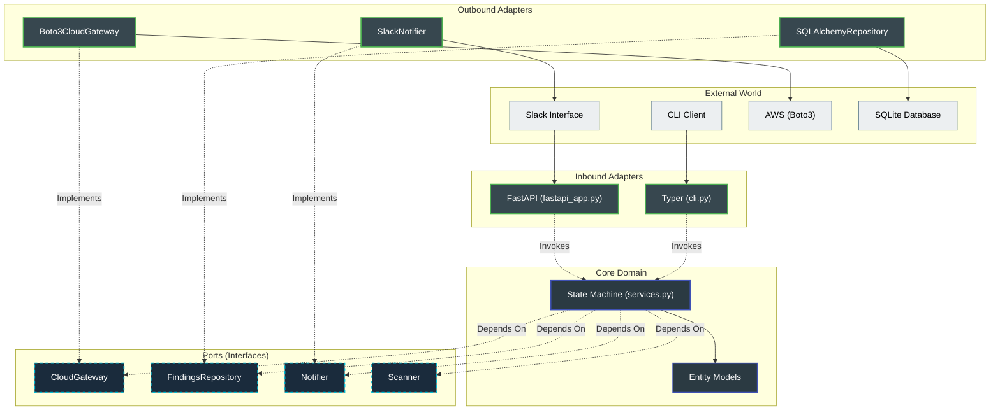
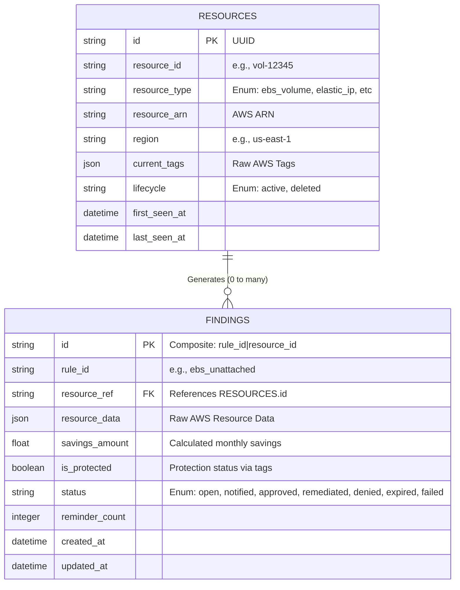

# FinOps Sentinel

[](https://opensource.org/licenses/MIT)
[](https://www.python.org/downloads/)
[]()
[]()

**FinOps Sentinel** is an automated, event-driven AWS Cost Optimization Agent engineered to continuously scan, evaluate, and remediate wasted resources across AWS environments. 

By applying strict FinOps principles, it identifies cloud waste (e.g., unattached EBS volumes, orphaned Elastic IPs, stopped EC2 instances), calculates potential monthly savings, and facilitates automated or Human-in-the-Loop (HITL) remediation via Slack.

---

## System Architecture

FinOps Sentinel is built on **Hexagonal Architecture (Ports & Adapters)** and **Domain-Driven Design (DDD)**. The core business rules are strictly decoupled from external libraries, databases, and AWS interfaces.



---

## Database Schema

The persistence layer strictly maps to the Domain models, utilizing an event-driven lifecycle approach. Below is the Entity-Relationship Diagram (ERD).



---

## Progress

### Phase 1 Completed: Core Scanning Engine
The application's foundational layer is fully completed and verified:
*   **Inventory Tracking:** Implemented a two-pass scanner architecture. Pass 1 snapshots inventory to `Resource` tables and manages resource lifecycles. Pass 2 evaluates rules to produce actionable `Finding` records.
*   **Database Hardening:** Deployed Alembic migrations with strict SQLite schema rules, check constraints mapped to Domain enums, and a custom `SafeNumeric` TypeDecorator.
*   **Interactive CLI:** Built the `sentinel` command line tool powered by `Typer` and `Rich` to trigger scans and display formatted waste summaries.
*   **Test Suite Coverage:** Verified local functionality with a robust suite of unit and adapter tests using `pytest` and `moto`, achieving **89% overall code coverage**.

### Phase 2 Completed: Slack HITL & Remediation
The Human-In-The-Loop integration and automated playbooks are fully completed and verified:
*   **Slack Automation & HITL:** A fully functional FastAPI backend that receives interactive payloads from Slack Block Kit buttons. Includes real-time Slack message replacement and strict domain-layer verification to prevent duplicate executions.
*   **Remediation Playbooks:** Boto3 adapters explicitly mapped to resource cleanup (taking snapshots before deleting EBS volumes, releasing EIPs, terminating instances).


---

## Getting Started

### 1. Prerequisites
*   Python 3.11+
*   Docker & Docker Compose (for local emulation)

### 2. Local Environment Setup
Clone the repository and set up a virtual environment:
```bash
git clone https://github.com/boazleleina/finops-sentinel.git
cd finops-sentinel

# Set up virtual environment
python3 -m venv .venv
source .venv/bin/activate

# Install editable package with dev dependencies
pip install -e ".[dev]"
```

Set up local configurations:
```bash
cp .env.example .env
```
> **Note:** If you want to enable the interactive Slack alerts, please follow the [Slack Setup Guide](SLACK_SETUP.md) to configure your `.env` variables and Slack workspace correctly.

### 3. Spin Up and Seed Emulator
We use LocalStack to emulate live AWS services locally. 

Because we use Docker Compose Profiles to separate development dependencies from production workloads, you **must** pass the `--profile dev` flag to explicitly spin up the LocalStack emulator:
```bash
# Start LocalStack (Required: --profile dev)
docker compose --profile dev up -d

# Seed the environment with mock resources (EBS volumes, EIPs, EC2 instances)
python scripts/seed_localstack.py
```

### 4. Run a Scan
Trigger an on-demand cost optimization scan using the CLI:
```bash
sentinel scan
```

The output will display optimization opportunities in a formatted table:
```
Starting FinOps Sentinel Scan...
Loaded 3 scanners.

Scan completed in 0.05s
Inventory Discovered: 4 resources
Findings Generated: 4 violations

                                 Optimization Opportunities                                  
┏━━━━━━━━━━━━━━━━━━━━━┳━━━━━━━━━━━━━━┳━━━━━━━━━━━━━━━━┳━━━━━━━━━━━━━━━━┳━━━━━━━━━━━┳━━━━━━━━┓
┃ Resource ID         ┃ Type         ┃ Rule           ┃ Savings ($/mo) ┃ Protected ┃ Status ┃
┡━━━━━━━━━━━━━━━━━━━━━╇━━━━━━━━━━━━━━╇━━━━━━━━━━━━━━━━╇━━━━━━━━━━━━━━━━╇━━━━━━━━━━━╇━━━━━━━━┩
│ vol-7de366c8        │ ebs_volume   │ ebs_unattached │          $0.80 │    No     │ OPEN   │
│ vol-90a6df3f        │ ebs_volume   │ ebs_unattached │          $1.60 │    Yes    │ OPEN   │
...
```

### 5. Start the API & Slack Tunnel (Optional)
To enable the Human-In-The-Loop interactive Slack buttons, you need to run the FastAPI server and expose it to the internet using a tunnel like `ngrok`.

**First time setting up ngrok?**
Install it via Homebrew and add your auth token (get it from the [ngrok dashboard](https://dashboard.ngrok.com)):
```bash
brew install ngrok/ngrok/ngrok
ngrok config add-authtoken <your-auth-token>
```

Open a new terminal window and start the API:
```bash
source .venv/bin/activate
uvicorn finops_sentinel.adapters.inbound.fastapi_app:app --reload --port 8000
```

Open a second terminal window and start the tunnel:
```bash
ngrok http 8000
```
Copy the `Forwarding` URL from ngrok (e.g., `https://<your-id>.ngrok.app`) and paste it into your Slack App's **Interactivity & Shortcuts** page, appending `/callbacks/slack` to the end.

---

## Testing

Run the test suite along with coverage reports:
```bash
pytest tests/ -v --cov=src/finops_sentinel --cov-report=term-missing
```

---

## Roadmap
*   ~~**Phase 2:** Introduce FastAPI endpoints, Human-In-The-Loop (HITL) manual Slack callbacks (via Block Kit buttons), and automated AWS playbooks.~~ (Completed!)
*   **Phase 3:** Containerize applications using Docker and set up automated GitHub Actions CI/CD pipelines.
*   **Phase 4:** Integrate Ollama LLM-Advisor adapter for automated optimization descriptions and rolling anomaly spent detection.
*   **Phase 5:** Scaffold Kubernetes local orchestration via Helm charts.

---

## License

This project is licensed under the [MIT License](LICENSE) - see the LICENSE file for details.
