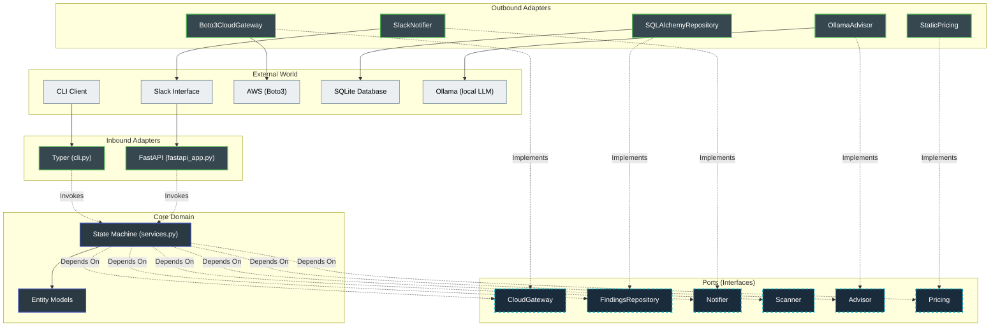
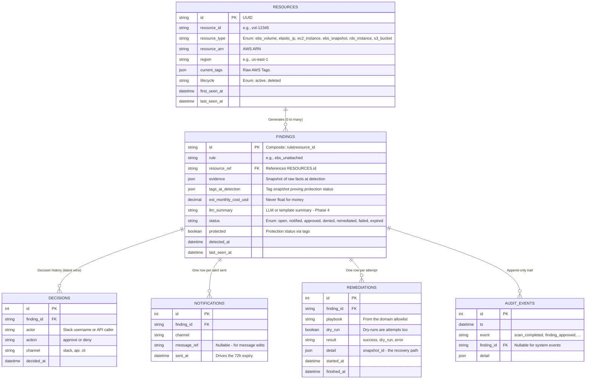

# FinOps Sentinel

[](https://opensource.org/licenses/MIT)
[](https://www.python.org/downloads/)
[]()
[]()
[]()

**FinOps Sentinel** is an automated, event-driven AWS Cost Optimization Agent engineered to continuously scan, evaluate, and remediate wasted resources across AWS environments. 

By applying strict FinOps principles, it identifies cloud waste (e.g., unattached EBS volumes, orphaned Elastic IPs, stopped EC2 instances, idle running instances), calculates potential monthly savings, and facilitates automated or Human-in-the-Loop (HITL) remediation via Slack.

---

## System Architecture

FinOps Sentinel is built on **Hexagonal Architecture (Ports & Adapters)** and **Domain-Driven Design (DDD)**. The core business rules are strictly decoupled from external libraries, databases, and AWS interfaces.

> [!TIP]
> **[ARCHITECTURE.md](ARCHITECTURE.md) is the full engineering document** — every port and adapter explained, the database design, the safety model, end-to-end execution flows, and the reasoning behind each significant decision. Read it if you are working on the code rather than running it.


```mermaid
flowchart TD
    %% Define Styles
    classDef core fill:#2b3a42,stroke:#3f51b5,stroke-width:2px,color:#fff
    classDef port fill:#1a2b3c,stroke:#00bcd4,stroke-width:2px,color:#fff,stroke-dasharray: 5 5
    classDef adapter fill:#37474f,stroke:#4caf50,stroke-width:2px,color:#fff
    classDef external fill:#eceff1,stroke:#607d8b,stroke-width:1px,color:#000

    subgraph External["External World"]
        CLI["CLI Client"]:::external
        SlackWeb["Slack Interface"]:::external
        AWS["AWS (Boto3)"]:::external
        SQLite["SQLite Database"]:::external
        Ollama["Ollama (local LLM)"]:::external
    end

    subgraph Adapters["Inbound Adapters"]
        Typer["Typer (cli.py)"]:::adapter
        FastAPI["FastAPI (fastapi_app.py)"]:::adapter
    end

    subgraph Ports["Ports (Interfaces)"]
        CloudGateway["CloudGateway"]:::port
        FindingsRepo["FindingsRepository"]:::port
        Notifier["Notifier"]:::port
        ScannerPort["Scanner"]:::port
        AdvisorPort["Advisor"]:::port
        PricingPort["Pricing"]:::port
    end

    subgraph Domain["Core Domain"]
        Models["Entity Models"]:::core
        Services["State Machine (services.py)"]:::core
    end

    subgraph OutboundAdapters["Outbound Adapters"]
        BotoAdapter["Boto3CloudGateway"]:::adapter
        SQLAdapter["SQLAlchemyRepository"]:::adapter
        SlackAdapter["SlackNotifier"]:::adapter
        OllamaAdapter["OllamaAdvisor"]:::adapter
        PricingAdapter["StaticPricing"]:::adapter
    end

    %% Inbound Flow
    CLI --> Typer
    SlackWeb --> FastAPI
    Typer -.->|Invokes| Services
    FastAPI -.->|Invokes| Services

    %% Domain Flow
    Services --> Models
    Services -.->|Depends On| CloudGateway
    Services -.->|Depends On| FindingsRepo
    Services -.->|Depends On| Notifier
    Services -.->|Depends On| ScannerPort
    Services -.->|Depends On| AdvisorPort
    Services -.->|Depends On| PricingPort

    %% Outbound Implementation
    BotoAdapter -.->|Implements| CloudGateway
    SQLAdapter -.->|Implements| FindingsRepo
    SlackAdapter -.->|Implements| Notifier
    OllamaAdapter -.->|Implements| AdvisorPort
    PricingAdapter -.->|Implements| PricingPort

    %% Outbound Flow
    BotoAdapter --> AWS
    SQLAdapter --> SQLite
    SlackAdapter --> SlackWeb
    OllamaAdapter --> Ollama
```

---

## Database Schema

The persistence layer strictly maps to the Domain models, utilizing an event-driven lifecycle approach. Below is the Entity-Relationship Diagram (ERD).


```mermaid
erDiagram
    RESOURCES {
        string id PK "UUID"
        string resource_id "e.g., vol-12345"
        string resource_type "Enum: ebs_volume, elastic_ip, ec2_instance, ebs_snapshot, rds_instance, s3_bucket"
        string resource_arn "AWS ARN"
        string region "e.g., us-east-1"
        json current_tags "Raw AWS Tags"
        string lifecycle "Enum: active, deleted"
        datetime first_seen_at
        datetime last_seen_at
    }

    FINDINGS {
        string id PK "Composite: rule|resource_id"
        string rule "e.g., ebs_unattached"
        string resource_ref FK "References RESOURCES.id"
        json evidence "Snapshot of raw facts at detection"
        json tags_at_detection "Tag snapshot proving protection status"
        decimal est_monthly_cost_usd "Never float for money"
        string llm_summary "LLM or template summary - Phase 4"
        string status "Enum: open, notified, approved, denied, remediated, failed, expired"
        boolean protected "Protection status via tags"
        datetime detected_at
        datetime last_seen_at
    }

    DECISIONS {
        int id PK
        string finding_id FK
        string actor "Slack username or API caller"
        string action "approve or deny"
        string channel "slack, api, cli"
        datetime decided_at
    }

    NOTIFICATIONS {
        int id PK
        string finding_id FK
        string channel
        string message_ref "Nullable - for message edits"
        datetime sent_at "Drives the 72h expiry"
    }

    REMEDIATIONS {
        int id PK
        string finding_id FK
        string playbook "From the domain allowlist"
        boolean dry_run "Dry-runs are attempts too"
        string result "success, dry_run, error"
        json detail "snapshot_id - the recovery path"
        datetime started_at
        datetime finished_at
    }

    AUDIT_EVENTS {
        int id PK
        datetime ts
        string event "scan_completed, finding_approved, ..."
        string finding_id FK "Nullable for system events"
        json detail
    }

    RESOURCES ||--o{ FINDINGS : "Generates (0 to many)"
    FINDINGS ||--o{ DECISIONS : "Decision history (latest wins)"
    FINDINGS ||--o{ NOTIFICATIONS : "One row per alert sent"
    FINDINGS ||--o{ REMEDIATIONS : "One row per attempt"
    FINDINGS ||--o{ AUDIT_EVENTS : "Append-only trail"
```

**Status transitions are atomic compare-and-swap** (`UPDATE ... WHERE status = expected`), so a Slack double-click, a race against the expiry job, or concurrent scans can never execute a remediation twice. Re-scans refresh evidence but can never resurrect a terminal finding (denied, remediated, expired).

---

## Progress

### Phase 1 Completed: Core Scanning Engine
The application's foundational layer is fully completed and verified:
*   **Inventory Tracking:** Implemented a two-pass scanner architecture. Pass 1 snapshots inventory to `Resource` tables and manages resource lifecycles. Pass 2 evaluates rules to produce actionable `Finding` records.
*   **Database Hardening:** Deployed Alembic migrations with strict SQLite schema rules, check constraints mapped to Domain enums, and a custom `SafeNumeric` TypeDecorator.
*   **Interactive CLI:** Built the `sentinel` command line tool powered by `Typer` and `Rich` to trigger scans and display formatted waste summaries.
*   **Test Suite Coverage:** Verified local functionality with a robust suite of unit and adapter tests using `pytest` and `moto`, achieving **92% overall code coverage** (112 tests across domain fakes, moto adapters, respx-mocked LLM tests, and a LocalStack integration suite).

### Phase 2 Completed: Slack HITL & Remediation
The Human-In-The-Loop integration and automated playbooks are fully completed and verified:
*   **Slack Automation & HITL:** A fully functional FastAPI backend that receives interactive payloads from Slack Block Kit buttons. Signing-secret verification, payload parsing, and message editing all live inside the Slack adapter behind the channel-generic `Notifier` port; the callback route is a thin `POST /callbacks/{channel}` wrapper. The edited message names the actual decision-maker ("Approved by @user").
*   **Remediation Playbooks:** Boto3 adapters explicitly mapped to resource cleanup (taking snapshots before deleting EBS volumes, releasing EIPs, terminating instances). Playbook names come from a domain-owned allowlist — resource types without an explicit playbook entry can never be acted on.
*   **Audit Trail & Decision Records:** Every scan, notification, approval, denial, execution, and failure is appended to an immutable `audit_events` log. Decisions record who acted, through which channel, and when. Remediation attempts (including dry-runs) are durably recorded with the pre-deletion `snapshot_id` as the recovery path.
*   **Safety Guardrails (domain-enforced):** `DRY_RUN=true` by default — a dry-run approval records the attempt but leaves the finding `APPROVED`, never falsely `REMEDIATED`. Resources tagged `finops:protected=true` are excluded at scan time and re-checked at approval time. Approvals against resources that have since disappeared are refused cleanly. All transitions are race-safe compare-and-swap operations.
*   **Finding Lifecycle:** Un-actioned notifications expire after 72 hours (`sentinel expire`), timed from the actual notification timestamp.

### Phase 3 Completed: Docker, CI/CD, & EBS Snapshots
The application is fully containerized and integrated with CI/CD pipelines:
*   **Containerization:** A multi-stage Dockerfile running a non-root user, bundled via Docker Compose to manage the FastAPI app and LocalStack emulator network effortlessly.
*   **CI/CD Automation:** GitHub Actions workflows (`ci.yml` and `build.yml`) established for rigorous static gates (Ruff, mypy, lint-imports), pytest test suites, Trivy vulnerability scanning, and automated image publishing to GHCR.
*   **EBS Snapshot Scanner:** Implemented a complex scanner that evaluates EBS snapshot age and checks if the origin volume has been deleted (orphaned snapshots), fully integrated into the existing framework.

**Full loop demo** — seed LocalStack, scan, Slack alert, one-click Approve, snapshot-then-delete remediation:


### Phase 4 (Part A) Completed: LLM Advisor & Idle EC2 Detection
*   **Advisor Port & Ollama Adapter:** Findings are narrated by a locally hosted model (`qwen3:30b-a3b` by default, with `qwen3:8b` for smaller hosts and CI) behind an `Advisor` port. Responses are validated against a strict Pydantic schema; every failure mode — timeout, transport error, non-JSON body, schema violation — degrades to a deterministic domain template, so a dead LLM can never block a notification.
*   **Idle EC2 Scanner:** A metric-inferred rule that flags *running* instances whose CloudWatch CPU **and** network have both flatlined across the observation window. It refuses to judge a series shorter than `EC2_IDLE_MIN_DATAPOINTS`, so freshly launched hosts and CloudWatch gaps read as "unknown" rather than "idle".
*   **Notify-Only Guardrail:** Metric-inferred rules are listed in `NOTIFY_ONLY_RULES` and are never remediable. The playbook allowlist is keyed by *resource type*, so without this rule-level gate an `ec2_idle` finding would inherit `terminate_stopped_instance` — and that instance is running. Slack omits the Approve button entirely for these findings rather than offering one the domain refuses.
*   **Inference Budget:** Local inference costs seconds per finding, so only the `ADVISOR_MAX_FINDINGS_PER_SCAN` costliest findings pay for a model call; the rest take the template. Notifications go out most-expensive-first.

Gate-check the local model at any time:
```bash
sentinel smoke-llm --iterations 10
```

### Phase 4 (Part B) Completed: RDS & S3 Scanners

Four new rules across two services, and the guardrail work that made room for them.

*   **RDS, deliberately hands-off.** `rds_idle` infers from `DatabaseConnections` rather than CPU — a database nobody connects to is serving nobody, whereas a quiet CPU can still be a replica or a nightly-batch target. `rds_stopped` is state-based with no grace period: allocated storage bills at full rate while the engine is down, and AWS restarts a stopped instance automatically after 7 days, so "I stopped it" is never the fix it appears to be. Neither rule is actionable, gated twice over — both are in `NOTIFY_ONLY_RULES`, **and** `RDS_INSTANCE` has no `PLAYBOOK_ALLOWLIST` entry at all. Deleting a database, even with a final snapshot, is the largest irreversible action in this system's reach and is out of scope for v1.
*   **S3, with two rules of deliberately different power.** `s3_incomplete_multipart` is exact and remediable: an abandoned multipart upload bills at full storage rate for parts that never became an object, and nothing in the console lists them. Its playbook deletes no object, because none was ever created. `s3_no_lifecycle` is advisory — a bucket without a policy is not *wholly* waste, so the finding reports a bounded fraction of its storage cost, with the fraction, the full cost and the raw size all in evidence so the estimate is auditable rather than magic.
*   **The guardrail that made S3 safe.** Both S3 rules sit on the same `ResourceType`, and `PLAYBOOK_ALLOWLIST` is keyed by type — so without listing `s3_no_lifecycle` in `NOTIFY_ONLY_RULES`, approving "no lifecycle policy" would have run the abort playbook belonging to its sibling. That is the closest the type-keyed allowlist has come to breaking; the code now records when it has to become rule-keyed.
*   **Scanner-level failure isolation.** `run_scan` already guaranteed one bad region could not end a scan. The same argument applied one level down and was missing: every scanner in a region shared one `try`, so the first to raise discarded all the others' findings. On a real account a single missing IAM grant would do this — and the result, no findings, is indistinguishable from a clean account. Scanners now fail independently, are reported in `ScanResult.scanners_failed`, audited, and printed by the CLI.

### Phase 4 (Part B2) Completed: Right-Sizing Digest & Spend Anomaly

A second output channel: patterns rather than individual findings, posted as one advisory message with no buttons on it.

*   **`sentinel digest` — advisory by construction.** The `Notifier.send_digest` contract forbids approve/deny affordances, and nothing in the digest path changes a finding's status. That is not a UI preference: a digest reports a *pattern*, and there is no finding id for a decision to act on. The one thing that can be approved is a `Finding`, and that still goes through the interactive alert path.
*   **Right-sizing reads peak CPU, never average.** A box that idles all day and pegs 90% once an hour is correctly sized; its mean is 4%, and a mean-based tool would recommend halving the machine that carries its actual workload. Suggestions require `RIGHTSIZING_MIN_DATAPOINTS` of history, exclude anything tagged `finops:protected=true`, and pair a 40% peak-CPU threshold with a candidate list that only ever steps down **one** size — halving vCPU roughly doubles utilisation, so 40% peak lands near 80% on the target.
*   **The digest re-reads CloudWatch instead of persisting metrics.** Right-sizing is about instances that are *not* idle, so no finding exists for them and no finding carries their metrics. The alternatives were a `metric_summaries` table written on every scan or one extra `GetMetricStatistics` pass on a weekly digest. The pass costs $0.01/1000 requests; the table is a schema forever.
*   **"Estimated waste", not spend — stated everywhere the number appears.** There is no billing data in this system: Cost Explorer needs a real account and bills per request. What is genuinely available daily is the total `est_monthly_cost_usd` of live findings, which is what `spend_snapshots` records and what the z-score runs over. A Cost-Explorer-backed adapter can replace the input later without the maths changing — that is the port design paying off, and it is a better README line than a wrong number.
*   **The anomaly maths is stdlib, in the domain, and the LLM only narrates it.** The spec said "deterministic pandas, in domain"; the architecture contract is named *"Domain is pure Python (pydantic only)"*, and a rolling mean/stdev/z-score is about twenty lines of `statistics`. Taking a 60MB dependency to avoid writing them would have made that claim false. Guards return *no verdict* rather than a weak one: fewer than `ANOMALY_MIN_HISTORY_DAYS` of history, or a zero-variance baseline, produces nothing — an alert that fires on three days of noise is one people learn to mute.
*   **The candidate day is excluded from its own baseline.** At seven samples, a spike included in the mean and stdev it is being measured against inflates both enough to hide itself. Snapshots are also upserted **by date**, so three scans in one day collapse to one row — otherwise scan cadence, not spend, would decide how much a day weighs.

```bash
sentinel digest            # post it
sentinel digest --no-send  # render locally without spending a notification
```

---

---

## Getting Started

From a fresh clone to Slack alerts in about five minutes. Every command below is copy-pasteable and was run end to end on a clean checkout.

### 1. Prerequisites

| Requirement | Why | Required? |
|---|---|---|
| Docker & Docker Compose | Runs the API and the LocalStack AWS emulator | Yes |
| Python 3.11+ | Seeding the emulator and running the test suite | Yes |
| [Ollama](https://ollama.com) | LLM-written finding summaries | Optional — set `ADVISOR_PROVIDER=template` to skip |
| [ngrok](https://ngrok.com) | Lets Slack reach your local API so the buttons work | Optional — only for interactive approval |

> [!NOTE]
> Ollama runs **natively on the host**, not in a container: Docker on Apple Silicon has no GPU passthrough, so a containerized Ollama would be CPU-only. The app container reaches the host daemon at `http://host.docker.internal:11434`, which `docker-compose.yml` already configures.

### 2. Clone and configure

```bash
git clone https://github.com/boazleleina/finops-sentinel.git
cd finops-sentinel
cp .env.example .env
```

`.env` works as-is for a console-only run. For Slack alerts, fill in `SLACK_WEBHOOK_URL` and `SLACK_SIGNING_SECRET` — see the [Slack Setup Guide](SLACK_SETUP.md).

> [!WARNING]
> `.env.example` ships with `DRY_RUN=true`, so approvals only log what they *would* do. Setting `DRY_RUN=false` makes an Approve click really delete resources. Keep `AWS_ENDPOINT_URL` pointed at LocalStack while testing, or you will be deleting real AWS infrastructure.

Pull a model if you want LLM summaries:

```bash
ollama pull qwen3:30b-a3b   # primary; use qwen3:8b on smaller hosts
                            # set OLLAMA_MODEL to switch — no code change
```

### 3. Start the stack

The `dev` profile is required — it brings up LocalStack alongside the API:

```bash
docker compose --profile dev up -d --build
```

This starts `localstack` (the AWS emulator) and `app` (the FastAPI server on port 8000).

> [!WARNING]
> **`docker compose up -d` on its own does nothing** — it exits with `no service selected`. Both services sit behind the `dev`/`full` profiles, so the `--profile dev` flag is not optional.

If the build fails on `failed to solve: DeadlineExceeded` while loading metadata for `python:3.11-slim`, that is Docker Hub being unreachable, not a problem with this repo. Fetch the base image once and re-run:

```bash
docker pull python:3.11-slim
docker compose --profile dev up -d --build
```

You can also skip the container entirely — see [Running from the host](#running-from-the-host) below. LocalStack alone is enough for every CLI command:

```bash
docker compose --profile dev up -d localstack
```

> [!IMPORTANT]
> The image bakes the source in with `COPY`, so **after any code change you must `docker compose build app`**. Restarting the container silently re-runs the old image — which looks exactly like your change having no effect.

### 4. Create the database

Alembic migrations are the only way the schema is ever created or changed. Run them **inside the container**:

```bash
docker compose exec app alembic upgrade head
```

> [!IMPORTANT]
> The container stores findings at `/app/data/sentinel.db`, and `docker-compose.yml` bind-mounts `./data` there, so with the shipped `SENTINEL_DB_PATH=data/sentinel.db` the host and the container are reading **one file**. Point them at different files and the mismatch is silent until every Slack **Approve** fails with *"cannot be approved"* — the server looking up findings in a database the scan never wrote to.

Running it from the host works identically, and targets the same file:

```bash
alembic upgrade head
```

Alembic resolves the database through the application's own `SENTINEL_DB_PATH` setting — the same one `sentinel scan` reads, `.env` included. `alembic.ini` deliberately sets no `sqlalchemy.url`; a value there would read as authoritative and be silently ignored. If you need a one-off target, set the variable:

```bash
SENTINEL_DB_PATH=/tmp/scratch.db alembic upgrade head
```

> [!NOTE]
> Upgrading an existing installation? Run this before your next scan. Phase 4B widened the `resources` CHECK constraint for the new RDS and S3 types and added the `spend_snapshots` table the digest's anomaly detection writes to. A scan against a database missing the CHECK widening stops with an error naming this command — deliberately, since a half-written inventory would let the DELETED sweep disarm findings the failed pass never reached.

### 5. Seed the emulator

```bash
python3 -m venv .venv && source .venv/bin/activate
pip install -e ".[dev]"
python3 scripts/seed_localstack.py
```

> [!TIP]
> `python3`, not `python` — a venv built by `python3 -m venv` on macOS does not always create a bare `python` shim, and `command not found: python` is the result. `.venv/bin/python scripts/seed_localstack.py` works from any shell, activated or not.

This creates unattached EBS volumes (one tagged `finops:protected=true`), an orphaned Elastic IP, a stopped EC2 instance, orphaned snapshots, an idle running instance with the flat CloudWatch metrics the `ec2_idle` rule needs, and four S3 buckets — one unmanaged and versioned, one with a lifecycle policy that must *not* be flagged, one protected by tag, and one holding an abandoned multipart upload.

It creates no RDS instances: LocalStack's RDS support is Pro-tier, so a local scan reports both RDS scanners as failed instead. That is the expected output, not a misconfiguration — see [Known coverage gaps](#known-coverage-gaps).

> [!NOTE]
> The EC2 and EBS seeding is **not idempotent** — each run adds another full set of volumes, addresses and instances, so running it twice doubles those findings and your Slack messages. The S3 section *is* re-runnable, since bucket names are fixed. To start clean: `docker compose --profile dev down && rm -rf ./volume/* && docker compose --profile dev up -d`.

> [!TIP]
> The seeded multipart upload is minutes old, so the default 7-day `S3_INCOMPLETE_MPU_AGE_DAYS` correctly ignores it. To see that finding, scan with `S3_INCOMPLETE_MPU_AGE_DAYS=0`.

### 6. Run a scan

```bash
docker compose exec app sentinel scan
```

```
Starting FinOps Sentinel Scan...
Regions: us-east-1, eu-west-1, ap-southeast-2 (3)
Loaded 8 scanners per region.
Findings database: /app/data/sentinel.db

Scan completed in 3.15s
Inventory Discovered: 39 resources

6 scanner(s) failed — those resource types were not checked:
  ! us-east-1/IdleRDSScanner, us-east-1/StoppedRDSScanner, …
    ClientError: An error occurred (InternalFailure) when calling the…

Findings Generated: 24 violations
Notifications Sent: 15 (via slack)

                         Optimization Opportunities
┏━━━━━━━━━━━━━━━━━━━━━━━━━━━━┳━━━━━━━━━━━━━━━━┳━━━━━━━━━━━━━━━━━━┳━━━━━━━━━━┓
┃ Resource ID                ┃ Region         ┃ Rule             ┃     $/mo ┃
┡━━━━━━━━━━━━━━━━━━━━━━━━━━━━╇━━━━━━━━━━━━━━━━╇━━━━━━━━━━━━━━━━━━╇━━━━━━━━━━┩
│ [P] vol-66fbac19370d381b9  │ us-east-1      │ ebs_unattached   │    $1.60 │
│ i-fb31312b10175f96b        │ us-east-1      │ ec2_idle         │   $70.08 │
│ [P] finops-demo-protected… │ us-east-1      │ s3_no_lifecycle  │    $3.68 │
│ finops-demo-unmanaged-us-… │ us-east-1      │ s3_no_lifecycle  │    $3.68 │
│ i-6bd1543d54e7c349c        │ eu-west-1      │ ec2_idle         │  $280.32 │
...
└────────────────────────────┴────────────────┴──────────────────┴──────────┘
[P] protected by tag — reported, never notified, never remediated, and excluded
from the totals below.
```

The `Findings database:` line is printed deliberately — if it does not match the database your API server reads, approvals will fail. With the shipped `.env` both resolve to `./data/sentinel.db`, which docker-compose bind-mounts into the container; keep them pointed at one file.

`Inventory Discovered` counts what *this* scan saw in the cloud, not how many rows the database holds — resources seen by earlier scans and since deleted stay on file but are not counted here.

Three behaviours worth noting in that table. Anything marked `[P]` is **protected by tag**: it stays `OPEN`, is never notified, and is excluded from the savings total. Findings only alert on the `OPEN → NOTIFIED` transition, so **re-running a scan against the same database sends no new Slack messages** — that is the design (re-scans must never resurrect decided findings), not a bug. And the failed-scanner block is not an error to fix locally: it is RDS being unavailable in free LocalStack, reported rather than hidden, because an empty result set otherwise reads exactly like a clean account. For a fresh set of alerts, reset the database:

```bash
docker compose exec app sh -c 'rm -f /app/data/sentinel.db'
docker compose exec app alembic upgrade head
docker compose exec app sentinel scan
```

Each notified finding carries a summary written by the local model:

```
ec2_idle  $70.08  notified
    An EC2 instance (i-3f160ef23abcda2f2) in us-east-1 is idle, with low CPU and
    network usage over 14 days. Estimated monthly cost: $70.08. (risk: low)
    Next step: Consider stopping or terminating the instance if it's no longer needed.
```

### 7. Post the digest

Separate from findings: patterns rather than individual resources, in one advisory message with no buttons on it.

```bash
docker compose exec app sentinel digest
```

```
▲ Spend anomaly on 2026-07-29 — estimated monthly waste $412.50 vs. a $180.65
average (z=38.0) over 7 days.

                      Right-sizing Suggestions (advisory)
┏━━━━━━━━━━━━━━━━━━┳━━━━━━━━━━━━━┳━━━━━━━━━━━━┳━━━━━━━━━━━┳━━━━━━━━━┳━━━━━━━━━━┓
┃ Instance         ┃ Region      ┃ Now        ┃ Suggested ┃ Peak C… ┃ $/mo sa… ┃
┡━━━━━━━━━━━━━━━━━━╇━━━━━━━━━━━━━╇━━━━━━━━━━━━╇━━━━━━━━━━━╇━━━━━━━━━╇━━━━━━━━━━┩
│ i-a91ac43e9f268… │ eu-west-1   │ m5.2xlarge │ m6g.xlar… │    0.4% │  $167.90 │
│ i-48eb06977e861… │ ap-southea… │ c5.xlarge  │ c6g.large │    0.4% │   $74.46 │
│ i-da0a5c483e981… │ us-east-1   │ m5.large   │ m6g.large │    0.4% │   $13.87 │
└──────────────────┴─────────────┴────────────┴───────────┴─────────┴──────────┘

Right-sizing savings if all taken: $256.23/mo
Digest posted via slack.
```

`--no-send` renders it locally without posting, which is the safe way to see what it *would* say.

Two things you will see on a first run, both correct:

*   **"No spend anomaly (or too little history to judge — needs 7 days of scans)."** The z-score needs `ANOMALY_MIN_HISTORY_DAYS` of daily snapshots, and `sentinel scan` writes one row per day. On day one there is nothing to compare against, and the message says *too little history* rather than *no anomaly* — those are different statements and only one of them is reassuring.
*   **Right-sizing suggestions on the seeded idle instances.** The seeded `m5.2xlarge` / `c5.xlarge` / `m5.large` all have flat CloudWatch CPU, so each gets a Graviton or one-size-down target. Nothing here is remediable: resizing needs a stop/start you have to schedule, so the digest carries no Approve button by contract.

If regions fail, the digest says so rather than reporting a clean result — an empty suggestion list over regions that never answered means the opposite of an empty list over regions that did.

### 8. Enable the Slack buttons

The alerts arrive without this step, but clicking **Approve** or **Deny** needs Slack to reach your machine.

First time with ngrok:

```bash
brew install ngrok/ngrok/ngrok
ngrok config add-authtoken <your-auth-token>
```

The container already serves the API on port 8000, so you only need the tunnel:

```bash
ngrok http 8000
```

Copy the `Forwarding` URL (e.g. `https://<your-id>.ngrok.app`) into your Slack app's **Interactivity & Shortcuts** page, appending `/callbacks/slack`.

Now click a button. Approve runs the allowlisted playbook — for an unattached volume that means snapshot-then-delete, so the data is recoverable. The message updates twice: once immediately, which removes the buttons and names the playbook, and again when the playbook finishes. Snapshot-then-delete waits for the snapshot and takes minutes, so the acknowledgement cannot wait on it and still answer Slack inside three seconds; the approval is committed to the database before that first edit goes out, which is what makes a second click a no-op rather than a second deletion. Requests with an invalid signature are rejected with `401`, as are callbacks from a workspace or channel outside `SLACK_TEAM_ID` / `SLACK_ALLOWED_CHANNEL_IDS`, and approvals from an actor missing from `SENTINEL_APPROVERS`.

Several messages will have **no buttons**: the `ec2_idle`, `rds_idle`, `rds_stopped` and `s3_no_lifecycle` advisories, plus the whole digest. That is intentional, and it is the main reason an alert can look "missing" — an advisory posts as a plain message with no Approve/Deny row, so it reads differently from the interactive ones and is easy to scroll past. Metric-inferred and fractional-cost findings are never auto-remediated, so offering a button would promise an action the domain refuses.

### 9. Verify the LLM advisor (optional)

```bash
docker compose exec app sentinel smoke-llm --iterations 10
```

Expect `Schema-valid: 10/10` and a healthy verdict. To compare models without editing `.env`:

```bash
docker compose exec app sentinel smoke-llm --model qwen3:4B
```

The advisor never blocks the pipeline: if Ollama is unreachable, slow, or returns malformed JSON, findings fall back to deterministic template summaries and notifications still go out. You can prove that by pointing it at a dead port:

```bash
docker compose exec -e OLLAMA_BASE_URL=http://localhost:1 app sentinel scan
```

### Running from the host

Every `docker compose exec app sentinel …` command above works identically from your venv, against the same database and the same LocalStack. You need the venv anyway to seed, and it skips the rebuild-after-every-change step:

```bash
docker compose --profile dev up -d localstack   # LocalStack only; no image build
source .venv/bin/activate
alembic upgrade head
sentinel scan
sentinel digest
```

Host and container resolve `data/sentinel.db` to **one file** (`SENTINEL_DB_PATH` from `.env` on the host, the `./data` bind mount in the container), so findings written by one are visible to the other. The container is what you want running for the FastAPI server and Slack callbacks; the CLI does not need it.

### Why a scan sends no new Slack messages

Findings alert exactly once, on the `OPEN → NOTIFIED` transition. **Re-running a scan against the same database therefore sends nothing** — the second scan re-detects the same findings, updates their cost and evidence, and leaves their status alone. That is the design: a re-scan must never resurrect a finding you already denied or remediated.

So if alerts arrived once and then stopped, nothing is broken. To check what was actually sent rather than guessing:

```bash
sqlite3 -header -column data/sentinel.db "
  select f.rule, count(distinct f.id) findings, count(n.id) notified
  from findings f left join notifications n on n.finding_id = f.id
  group by f.rule order by f.rule;"
```

A rule showing fewer `notified` than `findings` is usually protected resources, which are counted as findings and deliberately never notified.

To get a fresh set of alerts, re-arm the findings you want rather than wiping the database:

```bash
# Re-notify every S3 finding on the next scan
sqlite3 data/sentinel.db \
  "update findings set status='open' where rule like 's3%' and status='notified';"
sentinel scan
```

Or start completely clean:

```bash
docker compose --profile dev down && rm -rf ./volume/* ./data/sentinel.db
docker compose --profile dev up -d
alembic upgrade head && python3 scripts/seed_localstack.py && sentinel scan
```

---

## Detection Rules

Eight scanners run on every pass, producing nine rules. Each finding has a stable id of `rule|resource_id`, so a re-detected finding updates in place rather than duplicating.

| Rule | Flags | Cost basis | Remediation |
|---|---|---|---|
| `ebs_unattached` | EBS volumes in the `available` state | Size × per-GB rate for the volume type | `snapshot_then_delete_volume` |
| `eip_orphaned` | Elastic IPs with no association | Flat idle public IPv4 rate | `release_eip` |
| `ec2_stopped` | Instances stopped longer than `STOPPED_EC2_THRESHOLD_DAYS` | Sum of the instance's still-billing EBS volumes | `terminate_stopped_instance` |
| `ebs_old_snapshot` | Snapshots older than `SNAPSHOT_AGE_THRESHOLD_DAYS`, **or** whose source volume is gone | Source volume size × snapshot rate | `delete_ebs_snapshot` |
| `ec2_idle` | **Running** instances whose average CPU *and* network both stayed under threshold for the whole window | Instance type's hourly rate × 730 | **None — advisory only** |
| `rds_idle` | **Available** databases whose average `DatabaseConnections` stayed at or below threshold for the whole window | Instance class × engine licence multiplier × 730, **plus** storage | **None — advisory only** |
| `rds_stopped` | Databases in the `stopped` state, with no grace period | Allocated storage only — compute genuinely is not billed while stopped | **None — advisory only** |
| `s3_no_lifecycle` | Buckets over `S3_MIN_BUCKET_SIZE_GB` with no lifecycle configuration | Storage cost × `S3_LIFECYCLE_ADDRESSABLE_FRACTION` | **None — advisory only** |
| `s3_incomplete_multipart` | Multipart uploads abandoned longer than `S3_INCOMPLETE_MPU_AGE_DAYS` | Exact sum of the uploaded parts | `abort_incomplete_multipart_uploads` |

Two guardrails apply to all of them. Anything tagged `finops:protected=true` is never notified and never actionable. And every rule marked *advisory only* is listed in `NOTIFY_ONLY_RULES`, so the domain refuses to remediate it and Slack omits the buttons entirely rather than offering one the domain intends to reject.

Rules land in `NOTIFY_ONLY_RULES` for two different reasons:

*   **Inferred rather than observed.** `ec2_idle` and `rds_idle` read metrics, and low activity is evidence, not proof — a warm standby, a batch host between runs, or a failover target looks identical to an abandoned one. `s3_no_lifecycle` reports a *fraction* of a cost, which is not a number worth acting on automatically.
*   **Too destructive for v1.** Both RDS rules are perfectly actionable — by a human. `RDS_INSTANCE` therefore has no `PLAYBOOK_ALLOWLIST` entry at all, so RDS is refused twice independently.

That double gating is not belt-and-braces for its own sake. `PLAYBOOK_ALLOWLIST` is keyed by **resource type**, and S3 is where that nearly broke: `s3_incomplete_multipart` is remediable and `s3_no_lifecycle` is not, yet both sit on `S3_BUCKET`. Without the rule-level gate, approving "no lifecycle policy" would have aborted uploads. The mapping holds only while no two rules on one type need *different* playbooks; when that changes, it has to become rule-keyed.

`ec2_stopped` findings record a `cost_basis` field in their evidence: `attached EBS volumes` when the real volumes were found in the scan inventory, or `assumed root volume` when they were not.

### Where a scanner cannot see

A scanner that fails is reported, never silently skipped. One unavailable service — a missing IAM grant, a region outage, an endpoint that does not implement the API — takes down only its own rules; every other scanner in that region still returns findings.

```
6 scanner(s) failed — those resource types were not checked:
  ! us-east-1/IdleRDSScanner, us-east-1/StoppedRDSScanner, …
    ClientError: An error occurred (InternalFailure) when calling the…
```

This exists because the failure mode it prevents is the most expensive one available: an empty result set reads exactly like a clean account. A region where *every* scanner fails is reported as a failed region instead, and is excluded from the DELETED sweep — otherwise a transient outage would mark that region's whole inventory as gone and disarm every finding it owns.

---

## Configuration

Every setting, its default, and what it does. All are environment variables, read from `.env`; see `.env.example` for a copy-pasteable template.

### Core

| Variable | Default | Purpose |
|---|---|---|
| `DRY_RUN` | `true` | When true, approvals log what they *would* do and change nothing |
| `AWS_ENDPOINT_URL` | `http://localhost:4566` | LocalStack endpoint. **Unset for real AWS** |
| `AWS_REGION` | `us-east-1` | Home region: used for region discovery, and scanned alone when `AWS_REGIONS` is empty |
| `AWS_REGIONS` | *(empty)* | Regions to scan: comma-separated, or `all`. See [Multi-Region Scanning](#multi-region-scanning) |
| `SCAN_MAX_WORKERS` | `8` | Regions scanned in parallel. `1` scans them one at a time |
| `AWS_ACCESS_KEY_ID` / `AWS_SECRET_ACCESS_KEY` | `test` | LocalStack dummies; replace or use an IAM role for real AWS |
| `SENTINEL_DB_PATH` | `data/sentinel.db` | SQLite file holding findings. docker-compose bind-mounts `./data` and points the container at `/app/data/sentinel.db`, so the default resolves to the **same file** from host and container. The scan and the API server must share it, or every Slack approval fails |

### Notifications

| Variable | Default | Purpose |
|---|---|---|
| `SLACK_WEBHOOK_URL` | *(empty)* | Outbound alerts. Falls back to the console notifier when unset |
| `SLACK_SIGNING_SECRET` | *(empty)* | Verifies inbound button callbacks; requests failing it get a `401` |

### Detection thresholds

| Variable | Default | Purpose |
|---|---|---|
| `STOPPED_EC2_THRESHOLD_DAYS` | `7` | Minimum days stopped before an instance is flagged |
| `SNAPSHOT_AGE_THRESHOLD_DAYS` | `30` | Minimum snapshot age before it is flagged |
| `EC2_IDLE_OBSERVATION_DAYS` | `14` | CloudWatch window examined for idleness |
| `EC2_IDLE_CPU_PERCENT` | `5.0` | Average CPU below this counts as idle |
| `EC2_IDLE_NETWORK_BYTES` | `1000000` | Average network below this counts as idle |
| `EC2_IDLE_MIN_DATAPOINTS` | `24` | Refuse to judge a shorter series — too little history reads as *unknown*, not *idle* |
| `RDS_IDLE_OBSERVATION_DAYS` | `14` | CloudWatch window examined for database idleness |
| `RDS_IDLE_MAX_CONNECTIONS` | `0.0` | Average `DatabaseConnections` at or below this counts as idle. Raise it if monitoring agents or connection poolers hold a permanent baseline open |
| `RDS_IDLE_MIN_DATAPOINTS` | `24` | Refuse to judge a shorter series — never guess on a production database |
| `S3_MIN_BUCKET_SIZE_GB` | `50` | Below this, a missing lifecycle policy is not worth an alert |
| `S3_INCOMPLETE_MPU_AGE_DAYS` | `7` | Uploads older than this are abandoned rather than in flight. Used to detect them **and** re-checked when the abort playbook runs |
| `S3_LIFECYCLE_ADDRESSABLE_FRACTION` | `0.20` | Share of a bucket's cost a lifecycle policy could plausibly recover |

There is deliberately no `RDS_STOPPED_THRESHOLD_DAYS`. `DescribeDBInstances` exposes no stopped-since timestamp, so "stopped for N days" is not a question the API can answer — and since AWS restarts a stopped instance after 7 days anyway, the state itself is the finding.

### Digest and anomaly

The digest is a separate output from findings: advisory, button-free, and never tied to a resource's lifecycle.

| Variable | Default | Purpose |
|---|---|---|
| `RIGHTSIZING_OBSERVATION_DAYS` | `14` | CloudWatch window read by `sentinel digest` |
| `RIGHTSIZING_CPU_HEADROOM_PERCENT` | `40.0` | **Peak** CPU below this suggests a smaller type. Peak, not average — see below |
| `RIGHTSIZING_MIN_DATAPOINTS` | `24` | Refuse to judge a shorter series |
| `DIGEST_MAX_ITEMS` | `10` | Cap on suggestions per digest; biggest savings sort first |
| `ANOMALY_WINDOW_DAYS` | `14` | Trailing window the mean and stdev are computed over |
| `ANOMALY_MIN_HISTORY_DAYS` | `7` | Below this many days of scan history there is no verdict |
| `ANOMALY_Z_THRESHOLD` | `2.0` | \|z\| at or above this is an anomaly — roughly the outer 5% of a normal distribution |

Raising `RIGHTSIZING_CPU_HEADROOM_PERCENT` without shortening the candidate table in `adapters/aws/pricing.py` breaks the pairing the default rests on: the table steps down at most one size precisely so a 40% peak lands near 80% after a halving.

The anomaly runs on **estimated monthly waste** — the total of open and notified, non-protected findings, snapshotted daily by `sentinel scan` into `spend_snapshots`. It is not billed spend, and the CLI, the digest, and the audit trail all say so.

### LLM advisor

| Variable | Default | Purpose |
|---|---|---|
| `ADVISOR_PROVIDER` | `ollama` | Which backend implements the `Advisor` port: `ollama` or `template` |
| `OLLAMA_BASE_URL` | `http://localhost:11434` | Ollama daemon. Containers use `http://host.docker.internal:11434` |
| `OLLAMA_MODEL` | `qwen3:30b-a3b` | Any tag `ollama list` shows. Drop to `qwen3:8b` on smaller hosts |
| `OLLAMA_TIMEOUT_SECONDS` | `30` | Per-request timeout; exceeding it falls back to a template summary |
| `ADVISOR_MAX_FINDINGS_PER_SCAN` | `25` | Cap on LLM calls per notify pass, spent on the costliest findings first |

Prices are deliberately **not** configurable here — see [Cost Estimates](#cost-estimates).

---

## Multi-Region Scanning

By default only `AWS_REGION` is scanned. `AWS_REGIONS` widens that:

```bash
AWS_REGIONS=us-east-1,eu-west-1,ap-southeast-2   # explicit list
AWS_REGIONS=all                                  # every region the account has enabled
```

`all` is resolved live via `ec2:DescribeRegions`, so a newly enabled region is picked up without a config change. Regions the account never opted into are excluded — every API call against one fails with `AuthFailure`, so scanning them is pure noise. Confirm what a run will cover before paying for it:

```bash
sentinel regions
```

Each region gets its own gateway and its own scanner instances, and they are scanned in parallel (`SCAN_MAX_WORKERS`), because wall clock is dominated by the per-instance CloudWatch calls the idle rule makes.

### What region isolation buys you

Four failure modes drove the design, and each is pinned by a test in `tests/unit/test_multi_region.py`:

*   **One bad region does not end the scan.** A region with a missing IAM grant, an outage, or a throttle is recorded and skipped; the others still report. The failures are printed in red, written to the audit log as `region_scan_failed`, and returned on `ScanResult.regions_failed`.
*   **A failed region keeps its inventory.** The stale-resource sweep is scoped to the regions that actually succeeded. A global sweep would mark every resource in the failed region `DELETED`, and `DELETED` resources are refused by `approve_finding` — a transient API error would silently disarm every finding in that region.
*   **Evaluation never pools across regions.** Each scanner sees only its own region's inventory. Otherwise a volume in one region could vouch for a snapshot in another (the orphan check), and region-A resources would be handed to region-B scanners.
*   **A total failure raises instead of reporting zero findings.** "No findings" and "could not reach AWS" look identical from the outside, and the first one gets acted on by doing nothing.

Remediation follows the finding: `approve_finding` resolves the gateway from the resource's own region, not from `AWS_REGION`. An `eu-west-1` volume deleted through the `us-east-1` endpoint fails with `InvalidVolume.NotFound`, which reads as *already gone* rather than *wrong region*.

### Caveats

*   **Savings estimates stay us-east-1 list prices** in every region, so multi-region totals are conservative. The static pricing adapter logs a warning once per off-region — see [Cost Estimates](#cost-estimates).
*   **IAM:** the scan needs its usual read grants **in every scanned region**, plus `ec2:DescribeRegions` when using `AWS_REGIONS=all`. Region-scoped IAM conditions are the most common cause of a partially failed scan.
*   **Dropping a region from `AWS_REGIONS` does not delete its inventory.** Resources there stay `ACTIVE` at their last-seen state, since an unscanned region cannot be observed. Scan it once more to retire them.

### Swapping the model or the backend

Changing models needs no code change at all:

```bash
OLLAMA_MODEL=qwen3:8b                          # persistent, via .env
sentinel smoke-llm --model qwen3:4B            # one-off, to compare before committing
```

Changing the *backend* — a hosted API, vLLM, llama.cpp — means writing one adapter that implements `ports/advisor.py` and adding a single entry to `ADVISOR_PROVIDERS` in `bootstrap.py`, then setting `ADVISOR_PROVIDER` to its name. Nothing outside that dict and the new file changes, because every caller sees only the port. An unrecognised value fails loudly at startup and lists the valid names.

The same pattern applies to the `Pricing` port, and to `Notifier` if you want alerts somewhere other than Slack.

---

## Cost Estimates

Every AWS rate lives in exactly one file — `src/finops_sentinel/adapters/aws/pricing.py` — behind the `Pricing` port. Scanners receive the port and hold no prices of their own, so changing a rate is a one-line edit there rather than a hunt through scanner modules.

All rates are **us-east-1 on-demand list prices**, which bounds how far the reported savings can be trusted:

*   **Other regions cost more.** The static table applies us-east-1 rates everywhere and logs a warning (once per region) when asked for anything else.
*   **List price is not your price.** Reserved Instances, Savings Plans, and enterprise discounts all reduce the real figure — and if an instance is already covered by a commitment, deleting it saves nothing at all.
*   **Snapshots bill incrementally**, on changed blocks rather than full volume size, so snapshot estimates are an upper bound.

Unknown SKUs never return `$0`, because a zero-cost finding reads as "free" and disappears from the savings total. An unrecognised instance type falls back to a mid-range rate, and an unrecognised volume type to the priciest common one, so unknowns are never dismissed as harmless.

Three rules price differently, and each says so in its evidence:

*   **`rds_idle` reports compute *plus* storage**, since deleting the instance stops both meters. Compute is multiplied by an engine licence factor — SQL Server and Oracle cost multiples of PostgreSQL on identical hardware, and pricing them alike would bury the single most expensive finding in the report under cheaper ones.
*   **`rds_stopped` reports storage only.** Compute genuinely is not billed while an instance is stopped; claiming otherwise would overstate the saving.
*   **`s3_no_lifecycle` reports a fraction, not the bucket.** A bucket without a lifecycle policy is not wholly waste — only the cold part of it can ever be tiered or expired. The finding reports `S3_LIFECYCLE_ADDRESSABLE_FRACTION` of the storage cost, and puts the fraction, the full cost and the raw size in `evidence` so the estimate is auditable rather than magic. Reporting the whole bucket would let one large bucket dominate the total and make every number here untrustworthy.

To move to real numbers, add a second adapter implementing the same port — against the [AWS Price List API](https://docs.aws.amazon.com/awsaccountbilling/latest/aboutv2/price-changes.html) for list prices (free, needs caching) or Cost and Usage Reports for actuals (needs S3 and Athena) — and return it from `bootstrap.get_pricing()`. No scanner changes are required.

---

## Troubleshooting

| Symptom | Cause | Fix |
|---|---|---|
| Slack Approve/Deny says *"cannot be approved"* on every message | The scan and the API server used different databases | Run both in the container (steps 4 and 6). Check the `Findings database:` line in the scan output |
| `OperationalError: no such table: resources` | Migrations never ran against this database | `docker compose exec app alembic upgrade head` |
| *"The findings database does not allow resource type 's3_bucket'"* | Database predates Phase 4B's new resource types | `docker compose exec app alembic upgrade head` |
| Every scan reports 6 failed RDS scanners | LocalStack's RDS support is Pro-tier | Expected locally — see [Known coverage gaps](#known-coverage-gaps). Nothing to fix |
| No S3 findings at all, but the buckets exist | Scanning an image built before Phase 4B | `docker compose build app && docker compose up -d app`. Source is copied into the image, so a restart alone re-runs old code |
| `s3_incomplete_multipart` never fires | The seeded upload is minutes old; the threshold is 7 days | Scan with `S3_INCOMPLETE_MPU_AGE_DAYS=0` |
| Scan reports findings but sends no Slack messages | Findings already left `OPEN`; alerts fire once per finding | Reset the database (end of step 6) |
| Twice as many findings as expected | `seed_localstack.py` ran more than once | Reset LocalStack (note in step 5) |
| Slack buttons do nothing / show a dispatch error | No tunnel, so Slack cannot reach localhost | Start ngrok and set the Interactivity URL (step 7) |
| Summaries look generic instead of model-written | Ollama unreachable, so the template fallback engaged | `sentinel smoke-llm` to diagnose; check `OLLAMA_BASE_URL` |
| Every CloudWatch call fails, `ec2_idle` never fires | LocalStack 3.x cannot speak the CBOR protocol modern botocore uses | `docker-compose.yml` pins `localstack:4`; rebuild if you changed it |

---

## CLI Commands

| Command | Description |
|---|---|
| `sentinel scan` | Two-pass scan across every configured region: inventory upsert, rule evaluation, then notify new findings |
| `sentinel digest` | Post the advisory digest: right-sizing suggestions and any spend anomaly. `--no-send` renders it locally without posting. Intended for a weekly schedule |
| `sentinel regions` | List the regions the current configuration will scan, without running one |
| `sentinel serve` | Start the FastAPI server (`--host`, `--port`) |
| `sentinel expire` | Expire NOTIFIED findings older than 72 hours |
| `sentinel smoke-llm` | Gate-check the local Ollama advisor (`--iterations`); reports schema-adherence and latency, exits non-zero on any failure |

## API Reference

| Endpoint | Description |
|---|---|
| `GET /health` | Liveness check |
| `GET /findings?status=` | List findings, optionally filtered by status |
| `GET /resources` | Full resource inventory (including soft-deleted) |
| `GET /audit?finding_id=` | Append-only audit trail |
| `POST /decisions/{finding_id}` | Approve or deny a finding (`{"action": "approve", "actor": "name"}`) |
| `POST /callbacks/{channel}` | Interactive callbacks from the configured notifier (e.g. Slack buttons) |

---

## Testing

Run the test suite along with coverage reports:
```bash
pytest tests/ -v --cov=src/finops_sentinel --cov-report=term-missing
```

The suite is split by speed: unit tests (`tests/unit/`) run against in-memory fakes and moto with no external dependencies; the integration test (`tests/integration/`) drives the full loop — seed, scan, approve via the real API, verify the volume is snapshotted and deleted in LocalStack, audit trail complete — and skips itself automatically when LocalStack is not running.

Static gates (all enforced):
```bash
ruff check src tests     # linting
mypy src                 # strict type checking
lint-imports             # architecture: domain imports nothing external, dependencies point inward
```

### Coverage gates

Two, not one:

```bash
pytest tests/ --cov=src/finops_sentinel --cov-fail-under=90   # global
coverage report --include='*/domain/*' --fail-under=95        # the domain layer
```

A single flat number would let `domain/` rot as long as the adapters compensated, which is backwards — the guardrails, the state machine and the approval logic all live there, and all of it is testable with in-memory fakes. The adapters spend their statements on boto3 and HTTP calls that are only coverable by mocking the client back at itself, so holding them to the same bar buys thin tests rather than real ones.

`ports/` is deliberately excluded from the domain gate. Its abstract bodies are `...` under `# pragma: no cover`, leaving only imports and `def` lines that execute on import — it reports 100% without a single test, and would only pad the denominator.

### Known coverage gaps

Where the free emulator cannot exercise a feature, the gap is recorded rather than worked around with emulator-shaped production code.

| Gap | Consequence | Covered instead by | Revisited |
|---|---|---|---|
| **LocalStack RDS is Pro-tier** | `rds_idle` and `rds_stopped` have no end-to-end test anywhere. The seed script creates no databases, and a local scan reports both scanners as failed | moto unit tests for all scanner logic; an integration test asserts the *degradation* path — that RDS failing does not cost the other scanners their findings | Phase 6, against a real account in read-only `DRY_RUN=true` mode |
| **LocalStack publishes no `AWS/S3 BucketSizeBytes`** | `s3_no_lifecycle` would never fire locally, since bucket size is read from CloudWatch only | `scripts/seed_localstack.py` publishes synthetic datapoints, exactly as it already does for EC2 idle metrics — covered, not skipped | — |
| **moto stamps multipart uploads with a fixed 2010 date** | Upload *age* cannot be varied against moto | The abort playbook's age re-check is tested by moving the threshold instead of the timestamp | — |

One consequence is worth stating plainly: **S3 bucket size is queried with two CloudWatch dimensions** (`BucketName` *and* `StorageType`), because CloudWatch matches dimension sets exactly. Neither moto nor LocalStack publishes that metric, so neither would have caught a single-dimension query — it returns empty for an unrelated reason, and empty is also what "no data" legitimately looks like. That call is pinned by an explicit test rather than left to an end-to-end assertion that cannot exist.

---

## Roadmap
*   ~~**Phase 2:** Introduce FastAPI endpoints, Human-In-The-Loop (HITL) manual Slack callbacks (via Block Kit buttons), and automated AWS playbooks.~~ (Completed)
*   ~~**Phase 3:** Containerize applications using Docker and set up automated GitHub Actions CI/CD pipelines.~~ (Completed)
*   ~~**Phase 4 (Part A):** Integrate the Ollama LLM-Advisor adapter for automated optimization descriptions, plus metric-based idle EC2 detection.~~ (Completed)
*   ~~**Phase 4 (Part B1):** `rds_idle` / `rds_stopped` and the S3 lifecycle scanners, an Alembic migration for the new resource types, and per-scanner failure isolation.~~ (Completed)
*   ~~**Phase 4 (Part B2):** Right-sizing digest (14-day metric summaries → advisory-only, no buttons) and anomaly detection — a rolling z-score over daily estimated waste, computed deterministically in the domain with the Advisor only narrating it.~~ (Completed)
*   **Phase 5:** Scaffold Kubernetes local orchestration via Helm charts.

---

## License

This project is licensed under the [MIT License](LICENSE) - see the LICENSE file for details.
