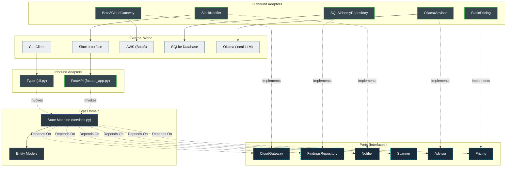
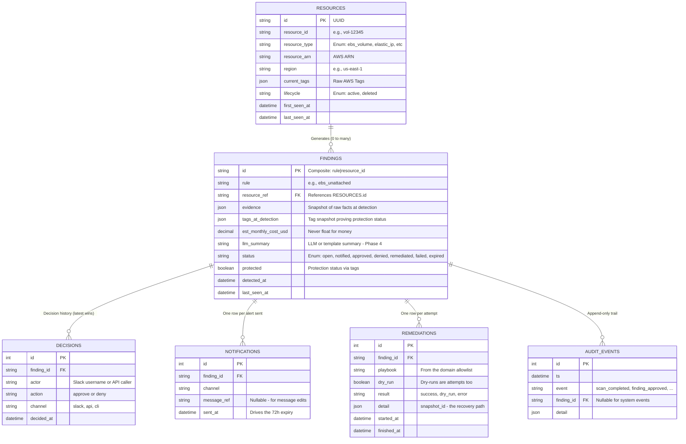

# FinOps Sentinel

[](https://opensource.org/licenses/MIT)
[](https://www.python.org/downloads/)
[]()
[]()
[]()

**FinOps Sentinel** is an automated, event-driven AWS Cost Optimization Agent engineered to continuously scan, evaluate, and remediate wasted resources across AWS environments. 

By applying strict FinOps principles, it identifies cloud waste (e.g., unattached EBS volumes, orphaned Elastic IPs, stopped EC2 instances, idle running instances), calculates potential monthly savings, and facilitates automated or Human-in-the-Loop (HITL) remediation via Slack.

---

## System Architecture

FinOps Sentinel is built on **Hexagonal Architecture (Ports & Adapters)** and **Domain-Driven Design (DDD)**. The core business rules are strictly decoupled from external libraries, databases, and AWS interfaces.


```mermaid
flowchart TD
    %% Define Styles
    classDef core fill:#2b3a42,stroke:#3f51b5,stroke-width:2px,color:#fff
    classDef port fill:#1a2b3c,stroke:#00bcd4,stroke-width:2px,color:#fff,stroke-dasharray: 5 5
    classDef adapter fill:#37474f,stroke:#4caf50,stroke-width:2px,color:#fff
    classDef external fill:#eceff1,stroke:#607d8b,stroke-width:1px,color:#000

    subgraph External["External World"]
        CLI["CLI Client"]:::external
        SlackWeb["Slack Interface"]:::external
        AWS["AWS (Boto3)"]:::external
        SQLite["SQLite Database"]:::external
        Ollama["Ollama (local LLM)"]:::external
    end

    subgraph Adapters["Inbound Adapters"]
        Typer["Typer (cli.py)"]:::adapter
        FastAPI["FastAPI (fastapi_app.py)"]:::adapter
    end

    subgraph Ports["Ports (Interfaces)"]
        CloudGateway["CloudGateway"]:::port
        FindingsRepo["FindingsRepository"]:::port
        Notifier["Notifier"]:::port
        ScannerPort["Scanner"]:::port
        AdvisorPort["Advisor"]:::port
        PricingPort["Pricing"]:::port
    end

    subgraph Domain["Core Domain"]
        Models["Entity Models"]:::core
        Services["State Machine (services.py)"]:::core
    end

    subgraph OutboundAdapters["Outbound Adapters"]
        BotoAdapter["Boto3CloudGateway"]:::adapter
        SQLAdapter["SQLAlchemyRepository"]:::adapter
        SlackAdapter["SlackNotifier"]:::adapter
        OllamaAdapter["OllamaAdvisor"]:::adapter
        PricingAdapter["StaticPricing"]:::adapter
    end

    %% Inbound Flow
    CLI --> Typer
    SlackWeb --> FastAPI
    Typer -.->|Invokes| Services
    FastAPI -.->|Invokes| Services

    %% Domain Flow
    Services --> Models
    Services -.->|Depends On| CloudGateway
    Services -.->|Depends On| FindingsRepo
    Services -.->|Depends On| Notifier
    Services -.->|Depends On| ScannerPort
    Services -.->|Depends On| AdvisorPort
    Services -.->|Depends On| PricingPort

    %% Outbound Implementation
    BotoAdapter -.->|Implements| CloudGateway
    SQLAdapter -.->|Implements| FindingsRepo
    SlackAdapter -.->|Implements| Notifier
    OllamaAdapter -.->|Implements| AdvisorPort
    PricingAdapter -.->|Implements| PricingPort

    %% Outbound Flow
    BotoAdapter --> AWS
    SQLAdapter --> SQLite
    SlackAdapter --> SlackWeb
    OllamaAdapter --> Ollama
```

---

## Database Schema

The persistence layer strictly maps to the Domain models, utilizing an event-driven lifecycle approach. Below is the Entity-Relationship Diagram (ERD).


```mermaid
erDiagram
    RESOURCES {
        string id PK "UUID"
        string resource_id "e.g., vol-12345"
        string resource_type "Enum: ebs_volume, elastic_ip, etc"
        string resource_arn "AWS ARN"
        string region "e.g., us-east-1"
        json current_tags "Raw AWS Tags"
        string lifecycle "Enum: active, deleted"
        datetime first_seen_at
        datetime last_seen_at
    }

    FINDINGS {
        string id PK "Composite: rule|resource_id"
        string rule "e.g., ebs_unattached"
        string resource_ref FK "References RESOURCES.id"
        json evidence "Snapshot of raw facts at detection"
        json tags_at_detection "Tag snapshot proving protection status"
        decimal est_monthly_cost_usd "Never float for money"
        string llm_summary "LLM or template summary - Phase 4"
        string status "Enum: open, notified, approved, denied, remediated, failed, expired"
        boolean protected "Protection status via tags"
        datetime detected_at
        datetime last_seen_at
    }

    DECISIONS {
        int id PK
        string finding_id FK
        string actor "Slack username or API caller"
        string action "approve or deny"
        string channel "slack, api, cli"
        datetime decided_at
    }

    NOTIFICATIONS {
        int id PK
        string finding_id FK
        string channel
        string message_ref "Nullable - for message edits"
        datetime sent_at "Drives the 72h expiry"
    }

    REMEDIATIONS {
        int id PK
        string finding_id FK
        string playbook "From the domain allowlist"
        boolean dry_run "Dry-runs are attempts too"
        string result "success, dry_run, error"
        json detail "snapshot_id - the recovery path"
        datetime started_at
        datetime finished_at
    }

    AUDIT_EVENTS {
        int id PK
        datetime ts
        string event "scan_completed, finding_approved, ..."
        string finding_id FK "Nullable for system events"
        json detail
    }

    RESOURCES ||--o{ FINDINGS : "Generates (0 to many)"
    FINDINGS ||--o{ DECISIONS : "Decision history (latest wins)"
    FINDINGS ||--o{ NOTIFICATIONS : "One row per alert sent"
    FINDINGS ||--o{ REMEDIATIONS : "One row per attempt"
    FINDINGS ||--o{ AUDIT_EVENTS : "Append-only trail"
```

**Status transitions are atomic compare-and-swap** (`UPDATE ... WHERE status = expected`), so a Slack double-click, a race against the expiry job, or concurrent scans can never execute a remediation twice. Re-scans refresh evidence but can never resurrect a terminal finding (denied, remediated, expired).

---

## Progress

### Phase 1 Completed: Core Scanning Engine
The application's foundational layer is fully completed and verified:
*   **Inventory Tracking:** Implemented a two-pass scanner architecture. Pass 1 snapshots inventory to `Resource` tables and manages resource lifecycles. Pass 2 evaluates rules to produce actionable `Finding` records.
*   **Database Hardening:** Deployed Alembic migrations with strict SQLite schema rules, check constraints mapped to Domain enums, and a custom `SafeNumeric` TypeDecorator.
*   **Interactive CLI:** Built the `sentinel` command line tool powered by `Typer` and `Rich` to trigger scans and display formatted waste summaries.
*   **Test Suite Coverage:** Verified local functionality with a robust suite of unit and adapter tests using `pytest` and `moto`, achieving **92% overall code coverage** (112 tests across domain fakes, moto adapters, respx-mocked LLM tests, and a LocalStack integration suite).

### Phase 2 Completed: Slack HITL & Remediation
The Human-In-The-Loop integration and automated playbooks are fully completed and verified:
*   **Slack Automation & HITL:** A fully functional FastAPI backend that receives interactive payloads from Slack Block Kit buttons. Signing-secret verification, payload parsing, and message editing all live inside the Slack adapter behind the channel-generic `Notifier` port; the callback route is a thin `POST /callbacks/{channel}` wrapper. The edited message names the actual decision-maker ("Approved by @user").
*   **Remediation Playbooks:** Boto3 adapters explicitly mapped to resource cleanup (taking snapshots before deleting EBS volumes, releasing EIPs, terminating instances). Playbook names come from a domain-owned allowlist — resource types without an explicit playbook entry can never be acted on.
*   **Audit Trail & Decision Records:** Every scan, notification, approval, denial, execution, and failure is appended to an immutable `audit_events` log. Decisions record who acted, through which channel, and when. Remediation attempts (including dry-runs) are durably recorded with the pre-deletion `snapshot_id` as the recovery path.
*   **Safety Guardrails (domain-enforced):** `DRY_RUN=true` by default — a dry-run approval records the attempt but leaves the finding `APPROVED`, never falsely `REMEDIATED`. Resources tagged `finops:protected=true` are excluded at scan time and re-checked at approval time. Approvals against resources that have since disappeared are refused cleanly. All transitions are race-safe compare-and-swap operations.
*   **Finding Lifecycle:** Un-actioned notifications expire after 72 hours (`sentinel expire`), timed from the actual notification timestamp.

### Phase 3 Completed: Docker, CI/CD, & EBS Snapshots
The application is fully containerized and integrated with CI/CD pipelines:
*   **Containerization:** A multi-stage Dockerfile running a non-root user, bundled via Docker Compose to manage the FastAPI app and LocalStack emulator network effortlessly.
*   **CI/CD Automation:** GitHub Actions workflows (`ci.yml` and `build.yml`) established for rigorous static gates (Ruff, mypy, lint-imports), pytest test suites, Trivy vulnerability scanning, and automated image publishing to GHCR.
*   **EBS Snapshot Scanner:** Implemented a complex scanner that evaluates EBS snapshot age and checks if the origin volume has been deleted (orphaned snapshots), fully integrated into the existing framework.

**Full loop demo** — seed LocalStack, scan, Slack alert, one-click Approve, snapshot-then-delete remediation:


### Phase 4 (Part A) Completed: LLM Advisor & Idle EC2 Detection
*   **Advisor Port & Ollama Adapter:** Findings are narrated by a locally hosted model (`qwen3:30b-a3b` by default, with `qwen3:8b` for smaller hosts and CI) behind an `Advisor` port. Responses are validated against a strict Pydantic schema; every failure mode — timeout, transport error, non-JSON body, schema violation — degrades to a deterministic domain template, so a dead LLM can never block a notification.
*   **Idle EC2 Scanner:** A metric-inferred rule that flags *running* instances whose CloudWatch CPU **and** network have both flatlined across the observation window. It refuses to judge a series shorter than `EC2_IDLE_MIN_DATAPOINTS`, so freshly launched hosts and CloudWatch gaps read as "unknown" rather than "idle".
*   **Notify-Only Guardrail:** Metric-inferred rules are listed in `NOTIFY_ONLY_RULES` and are never remediable. The playbook allowlist is keyed by *resource type*, so without this rule-level gate an `ec2_idle` finding would inherit `terminate_stopped_instance` — and that instance is running. Slack omits the Approve button entirely for these findings rather than offering one the domain refuses.
*   **Inference Budget:** Local inference costs seconds per finding, so only the `ADVISOR_MAX_FINDINGS_PER_SCAN` costliest findings pay for a model call; the rest take the template. Notifications go out most-expensive-first.

Gate-check the local model at any time:
```bash
sentinel smoke-llm --iterations 10
```

---

## Getting Started

From a fresh clone to Slack alerts in about five minutes. Every command below is copy-pasteable and was run end to end on a clean checkout.

### 1. Prerequisites

| Requirement | Why | Required? |
|---|---|---|
| Docker & Docker Compose | Runs the API and the LocalStack AWS emulator | Yes |
| Python 3.11+ | Seeding the emulator and running the test suite | Yes |
| [Ollama](https://ollama.com) | LLM-written finding summaries | Optional — set `ADVISOR_PROVIDER=template` to skip |
| [ngrok](https://ngrok.com) | Lets Slack reach your local API so the buttons work | Optional — only for interactive approval |

> [!NOTE]
> Ollama runs **natively on the host**, not in a container: Docker on Apple Silicon has no GPU passthrough, so a containerized Ollama would be CPU-only. The app container reaches the host daemon at `http://host.docker.internal:11434`, which `docker-compose.yml` already configures.

### 2. Clone and configure

```bash
git clone https://github.com/boazleleina/finops-sentinel.git
cd finops-sentinel
cp .env.example .env
```

`.env` works as-is for a console-only run. For Slack alerts, fill in `SLACK_WEBHOOK_URL` and `SLACK_SIGNING_SECRET` — see the [Slack Setup Guide](SLACK_SETUP.md).

> [!WARNING]
> `.env.example` ships with `DRY_RUN=true`, so approvals only log what they *would* do. Setting `DRY_RUN=false` makes an Approve click really delete resources. Keep `AWS_ENDPOINT_URL` pointed at LocalStack while testing, or you will be deleting real AWS infrastructure.

Pull a model if you want LLM summaries:

```bash
ollama pull qwen3:30b-a3b   # primary; use qwen3:8b on smaller hosts
                            # set OLLAMA_MODEL to switch — no code change
```

### 3. Start the stack

The `dev` profile is required — it brings up LocalStack alongside the API:

```bash
docker compose --profile dev up -d --build
```

This starts `localstack` (the AWS emulator) and `app` (the FastAPI server on port 8000).

### 4. Create the database

Alembic migrations are the only way the schema is ever created or changed. Run them **inside the container**:

```bash
docker compose exec app alembic upgrade head
```

> [!IMPORTANT]
> Run this *inside* the container, not on the host. The container stores findings at `/app/data/sentinel.db`, while a host-side `alembic upgrade head` targets `.sentinel.db` instead. Those are different files, and the mismatch is silent until every Slack **Approve** fails with *"cannot be approved"* — the server is looking up findings in a database the scan never wrote to. The same rule applies to scanning, which is why step 6 also runs in the container.

### 5. Seed the emulator

```bash
python3 -m venv .venv && source .venv/bin/activate
pip install -e ".[dev]"
python scripts/seed_localstack.py
```

This creates unattached EBS volumes (one tagged `finops:protected=true`), an orphaned Elastic IP, a stopped EC2 instance, orphaned snapshots, and an idle running instance with the flat CloudWatch metrics the `ec2_idle` rule needs.

> [!NOTE]
> The seeder is **not idempotent** — each run adds another full set of resources, so running it twice doubles your findings and your Slack messages. To start clean: `docker compose --profile dev down && rm -rf ./volume/* && docker compose --profile dev up -d`.

### 6. Run a scan

```bash
docker compose exec app sentinel scan
```

```
Starting FinOps Sentinel Scan...
Loaded 5 scanners.
Findings database: /app/data/sentinel.db

Scan completed in 0.44s
Inventory Discovered: 9 resources
Findings Generated: 6 violations
Notifications Sent: 5 (via slack)

                                 Optimization Opportunities
┏━━━━━━━━━━━━━━━━━━━━━┳━━━━━━━━━━━━━━┳━━━━━━━━━━━━━━━━┳━━━━━━━━━━━━━━━━┳━━━━━━━━━━━┳━━━━━━━━━━┓
┃ Resource ID         ┃ Type         ┃ Rule           ┃ Savings ($/mo) ┃ Protected ┃ Status   ┃
┡━━━━━━━━━━━━━━━━━━━━━╇━━━━━━━━━━━━━━╇━━━━━━━━━━━━━━━━╇━━━━━━━━━━━━━━━━╇━━━━━━━━━━━╇━━━━━━━━━━┩
│ vol-e3a10aefb156e43 │ ebs_volume   │ ebs_unattached │          $0.80 │    No     │ NOTIFIED │
│ vol-f9a3921e37a2da1 │ ebs_volume   │ ebs_unattached │          $1.60 │    Yes    │ OPEN     │
│ i-3f160ef23abcda2f2 │ ec2_instance │ ec2_idle       │         $70.08 │    No     │ NOTIFIED │
...
```

The `Findings database:` line is printed deliberately — if it does not match the database your API server reads, approvals will fail.

Two behaviours worth noting in that table. The **protected** volume stays `OPEN` and is never notified. And findings only alert on the `OPEN → NOTIFIED` transition, so **re-running a scan against the same database sends no new Slack messages** — that is the design (re-scans must never resurrect decided findings), not a bug. For a fresh set of alerts, reset the database:

```bash
docker compose exec app sh -c 'rm -f /app/data/sentinel.db'
docker compose exec app alembic upgrade head
docker compose exec app sentinel scan
```

Each notified finding carries a summary written by the local model:

```
ec2_idle  $70.08  notified
    An EC2 instance (i-3f160ef23abcda2f2) in us-east-1 is idle, with low CPU and
    network usage over 14 days. Estimated monthly cost: $70.08. (risk: low)
    Next step: Consider stopping or terminating the instance if it's no longer needed.
```

### 7. Enable the Slack buttons

The alerts arrive without this step, but clicking **Approve** or **Deny** needs Slack to reach your machine.

First time with ngrok:

```bash
brew install ngrok/ngrok/ngrok
ngrok config add-authtoken <your-auth-token>
```

The container already serves the API on port 8000, so you only need the tunnel:

```bash
ngrok http 8000
```

Copy the `Forwarding` URL (e.g. `https://<your-id>.ngrok.app`) into your Slack app's **Interactivity & Shortcuts** page, appending `/callbacks/slack`.

Now click a button. Approve runs the allowlisted playbook — for an unattached volume that means snapshot-then-delete, so the data is recoverable — and edits the original message with the outcome. Requests with an invalid signature are rejected with `401`.

One message will have **no buttons**: the `ec2_idle` advisory. That is intentional. Metric-inferred findings are never auto-remediated, so offering a button would promise an action the domain refuses.

### 8. Verify the LLM advisor (optional)

```bash
docker compose exec app sentinel smoke-llm --iterations 10
```

Expect `Schema-valid: 10/10` and a healthy verdict. To compare models without editing `.env`:

```bash
docker compose exec app sentinel smoke-llm --model qwen3:4B
```

The advisor never blocks the pipeline: if Ollama is unreachable, slow, or returns malformed JSON, findings fall back to deterministic template summaries and notifications still go out. You can prove that by pointing it at a dead port:

```bash
docker compose exec -e OLLAMA_BASE_URL=http://localhost:1 app sentinel scan
```

---

## Detection Rules

Five scanners run on every pass. Each produces findings with a stable id of `rule|resource_id`, so a re-detected finding updates in place rather than duplicating.

| Rule | Flags | Cost basis | Remediation |
|---|---|---|---|
| `ebs_unattached` | EBS volumes in the `available` state | Size × per-GB rate for the volume type | `snapshot_then_delete_volume` |
| `eip_orphaned` | Elastic IPs with no association | Flat idle public IPv4 rate | `release_eip` |
| `ec2_stopped` | Instances stopped longer than `STOPPED_EC2_THRESHOLD_DAYS` | Sum of the instance's still-billing EBS volumes | `terminate_stopped_instance` |
| `ebs_old_snapshot` | Snapshots older than `SNAPSHOT_AGE_THRESHOLD_DAYS`, **or** whose source volume is gone | Source volume size × snapshot rate | `delete_ebs_snapshot` |
| `ec2_idle` | **Running** instances whose average CPU *and* network both stayed under threshold for the whole window | Instance type's hourly rate × 730 | **None — advisory only** |

Two guardrails apply to all of them. Anything tagged `finops:protected=true` is never notified and never actionable. And `ec2_idle` is listed in `NOTIFY_ONLY_RULES`, so the domain refuses to remediate it and Slack omits the buttons — low CPU is evidence, not proof, since a warm standby or a batch host between runs looks identical to an abandoned one.

`ec2_stopped` findings record a `cost_basis` field in their evidence: `attached EBS volumes` when the real volumes were found in the scan inventory, or `assumed root volume` when they were not.

---

## Configuration

Every setting, its default, and what it does. All are environment variables, read from `.env`; see `.env.example` for a copy-pasteable template.

### Core

| Variable | Default | Purpose |
|---|---|---|
| `DRY_RUN` | `true` | When true, approvals log what they *would* do and change nothing |
| `AWS_ENDPOINT_URL` | `http://localhost:4566` | LocalStack endpoint. **Unset for real AWS** |
| `AWS_REGION` | `us-east-1` | Region scanned |
| `AWS_ACCESS_KEY_ID` / `AWS_SECRET_ACCESS_KEY` | `test` | LocalStack dummies; replace or use an IAM role for real AWS |
| `SENTINEL_DB_PATH` | `.sentinel.db` | SQLite file holding findings. The scan and the API server **must** share this |

### Notifications

| Variable | Default | Purpose |
|---|---|---|
| `SLACK_WEBHOOK_URL` | *(empty)* | Outbound alerts. Falls back to the console notifier when unset |
| `SLACK_SIGNING_SECRET` | *(empty)* | Verifies inbound button callbacks; requests failing it get a `401` |

### Detection thresholds

| Variable | Default | Purpose |
|---|---|---|
| `STOPPED_EC2_THRESHOLD_DAYS` | `7` | Minimum days stopped before an instance is flagged |
| `SNAPSHOT_AGE_THRESHOLD_DAYS` | `30` | Minimum snapshot age before it is flagged |
| `EC2_IDLE_OBSERVATION_DAYS` | `14` | CloudWatch window examined for idleness |
| `EC2_IDLE_CPU_PERCENT` | `5.0` | Average CPU below this counts as idle |
| `EC2_IDLE_NETWORK_BYTES` | `1000000` | Average network below this counts as idle |
| `EC2_IDLE_MIN_DATAPOINTS` | `24` | Refuse to judge a shorter series — too little history reads as *unknown*, not *idle* |

### LLM advisor

| Variable | Default | Purpose |
|---|---|---|
| `ADVISOR_PROVIDER` | `ollama` | Which backend implements the `Advisor` port: `ollama` or `template` |
| `OLLAMA_BASE_URL` | `http://localhost:11434` | Ollama daemon. Containers use `http://host.docker.internal:11434` |
| `OLLAMA_MODEL` | `qwen3:30b-a3b` | Any tag `ollama list` shows. Drop to `qwen3:8b` on smaller hosts |
| `OLLAMA_TIMEOUT_SECONDS` | `30` | Per-request timeout; exceeding it falls back to a template summary |
| `ADVISOR_MAX_FINDINGS_PER_SCAN` | `25` | Cap on LLM calls per notify pass, spent on the costliest findings first |

Prices are deliberately **not** configurable here — see [Cost Estimates](#cost-estimates).

### Swapping the model or the backend

Changing models needs no code change at all:

```bash
OLLAMA_MODEL=qwen3:8b                          # persistent, via .env
sentinel smoke-llm --model qwen3:4B            # one-off, to compare before committing
```

Changing the *backend* — a hosted API, vLLM, llama.cpp — means writing one adapter that implements `ports/advisor.py` and adding a single entry to `ADVISOR_PROVIDERS` in `bootstrap.py`, then setting `ADVISOR_PROVIDER` to its name. Nothing outside that dict and the new file changes, because every caller sees only the port. An unrecognised value fails loudly at startup and lists the valid names.

The same pattern applies to the `Pricing` port, and to `Notifier` if you want alerts somewhere other than Slack.

---

## Cost Estimates

Every AWS rate lives in exactly one file — `src/finops_sentinel/adapters/aws/pricing.py` — behind the `Pricing` port. Scanners receive the port and hold no prices of their own, so changing a rate is a one-line edit there rather than a hunt through scanner modules.

All rates are **us-east-1 on-demand list prices**, which bounds how far the reported savings can be trusted:

*   **Other regions cost more.** The static table applies us-east-1 rates everywhere and logs a warning (once per region) when asked for anything else.
*   **List price is not your price.** Reserved Instances, Savings Plans, and enterprise discounts all reduce the real figure — and if an instance is already covered by a commitment, deleting it saves nothing at all.
*   **Snapshots bill incrementally**, on changed blocks rather than full volume size, so snapshot estimates are an upper bound.

Unknown SKUs never return `$0`, because a zero-cost finding reads as "free" and disappears from the savings total. An unrecognised instance type falls back to a mid-range rate, and an unrecognised volume type to the priciest common one, so unknowns are never dismissed as harmless.

To move to real numbers, add a second adapter implementing the same port — against the [AWS Price List API](https://docs.aws.amazon.com/awsaccountbilling/latest/aboutv2/price-changes.html) for list prices (free, needs caching) or Cost and Usage Reports for actuals (needs S3 and Athena) — and return it from `bootstrap.get_pricing()`. No scanner changes are required.

---

## Troubleshooting

| Symptom | Cause | Fix |
|---|---|---|
| Slack Approve/Deny says *"cannot be approved"* on every message | The scan and the API server used different databases | Run both in the container (steps 4 and 6). Check the `Findings database:` line in the scan output |
| `OperationalError: no such table: resources` | Migrations never ran against this database | `docker compose exec app alembic upgrade head` |
| Scan reports findings but sends no Slack messages | Findings already left `OPEN`; alerts fire once per finding | Reset the database (end of step 6) |
| Twice as many findings as expected | `seed_localstack.py` ran more than once | Reset LocalStack (note in step 5) |
| Slack buttons do nothing / show a dispatch error | No tunnel, so Slack cannot reach localhost | Start ngrok and set the Interactivity URL (step 7) |
| Summaries look generic instead of model-written | Ollama unreachable, so the template fallback engaged | `sentinel smoke-llm` to diagnose; check `OLLAMA_BASE_URL` |
| Every CloudWatch call fails, `ec2_idle` never fires | LocalStack 3.x cannot speak the CBOR protocol modern botocore uses | `docker-compose.yml` pins `localstack:4`; rebuild if you changed it |

---

## CLI Commands

| Command | Description |
|---|---|
| `sentinel scan` | Two-pass scan: inventory upsert, rule evaluation, then notify new findings |
| `sentinel serve` | Start the FastAPI server (`--host`, `--port`) |
| `sentinel expire` | Expire NOTIFIED findings older than 72 hours |
| `sentinel smoke-llm` | Gate-check the local Ollama advisor (`--iterations`); reports schema-adherence and latency, exits non-zero on any failure |

## API Reference

| Endpoint | Description |
|---|---|
| `GET /health` | Liveness check |
| `GET /findings?status=` | List findings, optionally filtered by status |
| `GET /resources` | Full resource inventory (including soft-deleted) |
| `GET /audit?finding_id=` | Append-only audit trail |
| `POST /decisions/{finding_id}` | Approve or deny a finding (`{"action": "approve", "actor": "name"}`) |
| `POST /callbacks/{channel}` | Interactive callbacks from the configured notifier (e.g. Slack buttons) |

---

## Testing

Run the test suite along with coverage reports:
```bash
pytest tests/ -v --cov=src/finops_sentinel --cov-report=term-missing
```

The suite is split by speed: unit tests (`tests/unit/`) run against in-memory fakes and moto with no external dependencies; the integration test (`tests/integration/`) drives the full loop — seed, scan, approve via the real API, verify the volume is snapshotted and deleted in LocalStack, audit trail complete — and skips itself automatically when LocalStack is not running.

Static gates (all enforced):
```bash
ruff check src tests     # linting
mypy src                 # strict type checking
lint-imports             # architecture: domain imports nothing external, dependencies point inward
```

---

## Roadmap
*   ~~**Phase 2:** Introduce FastAPI endpoints, Human-In-The-Loop (HITL) manual Slack callbacks (via Block Kit buttons), and automated AWS playbooks.~~ (Completed)
*   ~~**Phase 3:** Containerize applications using Docker and set up automated GitHub Actions CI/CD pipelines.~~ (Completed)
*   ~~**Phase 4 (Part A):** Integrate the Ollama LLM-Advisor adapter for automated optimization descriptions, plus metric-based idle EC2 detection.~~ (Completed)
*   **Phase 4 (Part B):** Metric-based `rds_idle` and `s3_lifecycle` scanners, an Alembic migration for the new resource types, and rolling z-score anomaly detection on daily estimated spend.
*   **Phase 5:** Scaffold Kubernetes local orchestration via Helm charts.

---

## License

This project is licensed under the [MIT License](LICENSE) - see the LICENSE file for details.
