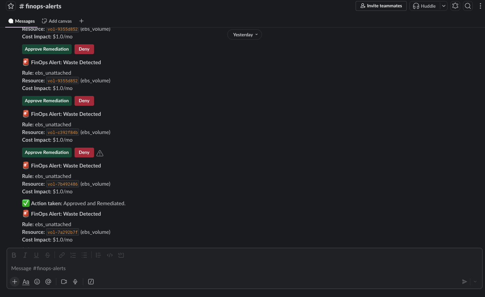

# Building a Slack Approval Workflow That Deletes Cloud Infrastructure

*Block Kit, signature verification, and the design decisions that stop a button click from becoming an incident.*

---



That screenshot is a bot asking permission to delete an EBS volume. Clicking
**Approve Remediation** snapshots the volume, waits for the snapshot to
complete, deletes the volume, and edits the message to say what happened.

Getting that to work is mostly plumbing. Getting it to work *safely* — so a
stale click, a replayed request, or a resource someone protected in the
meantime cannot cause damage — is the interesting part.

This walks through both, using the Slack adapter from
[FinOps Sentinel](https://github.com/boazleleina/finops-sentinel).

---

## The shape of the problem

Slack interactivity is two separate channels that only look like a conversation:

```
Your app ──── incoming webhook ────▶ Slack channel
                                          │
                                     user clicks
                                          │
Your app ◀─── HTTP POST ──────────────────┘
             (a completely new request, from Slack's servers)
```

The click arrives as an **unauthenticated POST from the public internet** to
whatever URL you registered. Nothing about the request proves it came from
Slack, or that a human clicked anything. That is the security problem in one
sentence, and everything below follows from it.

---

## Part 1: Setting up the Slack app

### Create the app and get a webhook

1. [api.slack.com/apps](https://api.slack.com/apps) → **Create New App** → **From scratch**
2. Name it, pick your workspace
3. **Incoming Webhooks** → toggle **On** → **Add New Webhook to Workspace**
4. Choose a channel, click **Allow**, copy the URL

```
SLACK_WEBHOOK_URL=https://hooks.slack.com/services/TXXXXX/BXXXXX/XXXXXXXX
```

Webhooks post to exactly one channel and cannot read anything. For a
notification bot that is the right amount of privilege — no OAuth flow, no bot
token, no scopes to review.

### Enable interactivity

**Interactivity & Shortcuts** → toggle **On** → set the Request URL:

```
https://your-domain.example/callbacks/slack
```

Locally you need a tunnel:

```bash
ngrok http 8000
# → https://a1b2c3d4.ngrok.app
# Request URL: https://a1b2c3d4.ngrok.app/callbacks/slack
```

The free ngrok URL changes on every restart, and you must update Slack each
time. Save yourself the confusion: if buttons "do nothing," check this first.

### Get the signing secret

**Basic Information** → **App Credentials** → **Signing Secret** → Show.

```
SLACK_SIGNING_SECRET=your_signing_secret_here
```

This is what makes callbacks trustworthy. Without it your endpoint will delete
infrastructure for anyone who sends it a well-formed POST.

---

## Part 2: Sending a message worth acting on

Block Kit messages are JSON arrays of blocks. The naive version works
immediately:

```python
from slack_sdk.webhook import WebhookClient

WebhookClient(webhook_url).send(text=f"Idle volume found: {volume_id}")
```

But an alert an engineer has to act on needs to answer *what, where, how much,
and what happens if I click this* — in about ten seconds, often on a phone.

Here is the real implementation:

```python
def send_finding_alert(self, finding: Finding, resource: Resource) -> str | None:
    webhook_url = settings.slack_webhook_url
    if not webhook_url:
        raise RuntimeError("SLACK_WEBHOOK_URL is not configured")

    remediable = is_remediable(finding.rule)
    header = (
        "*FinOps Alert: Waste Detected*"
        if remediable
        else "*FinOps Advisory: Possible Idle Resource*"
    )

    blocks: list[dict[str, Any]] = [
        {
            "type": "section",
            "text": {
                "type": "mrkdwn",
                "text": (
                    f"{header}\n\n"
                    f"*Rule:* {finding.rule}\n"
                    f"*Resource:* `{resource.resource_id}` ({resource.resource_type})\n"
                    # Region is not decoration: with several regions scanned, it is
                    # the first thing an approver needs to know where to look, and
                    # remediation runs there.
                    f"*Region:* `{resource.region}`\n"
                    f"*Cost Impact:* ${finding.est_monthly_cost_usd}/mo"
                ),
            },
        }
    ]
```

**The region line was added after a real confusion.** Scanning three regions
produces three near-identical alerts differing only by resource ID. Without the
region an approver cannot tell which account corner they are about to change.

### The LLM summary goes in its own block

```python
    if finding.llm_summary:
        # Advisor output is untrusted display copy (it summarizes
        # user-controlled tags), so it goes in its own context block and is
        # never used to build action values.
        blocks.append({
            "type": "context",
            "elements": [{"type": "mrkdwn", "text": finding.llm_summary}],
        })
```

A local LLM writes a plain-language explanation of each finding. The prompt
contains AWS tags — which anyone with tagging permission can write. So model
output is treated as **untrusted display copy**: rendered, never parsed, and
never used to build anything the system acts on.

### Buttons are conditional, and that is the whole design

```python
    if remediable:
        blocks.append({
            "type": "actions",
            "elements": [
                {
                    "type": "button",
                    "text": {"type": "plain_text", "text": "Approve Remediation"},
                    "style": "primary",
                    "value": f"approve_{finding.id}",
                    "action_id": "approve_remediation",
                },
                {
                    "type": "button",
                    "text": {"type": "plain_text", "text": "Deny"},
                    "style": "danger",
                    "value": f"deny_{finding.id}",
                    "action_id": "deny_remediation",
                },
            ],
        })
    else:
        # Metric-inferred: no playbook is allowed to run, so offering an
        # Approve button would promise an action the domain refuses.
        blocks.append({
            "type": "context",
            "elements": [{
                "type": "mrkdwn",
                "text": ("_Advisory only — inferred from CloudWatch metrics. "
                         "No automated remediation is available for this rule._"),
            }],
        })
```

Some findings are advisory by design. An idle EC2 instance might be a warm
standby, a batch worker between runs, or a license server — low CPU is
*evidence*, not proof. The domain refuses to remediate those rules.

The early version rendered buttons on every alert. Clicking Approve on an
advisory finding returned a refusal. **A button that does nothing is worse than
no button** — it trains people to distrust every button. So the adapter asks the
domain first and renders accordingly.

### Notification preview text

```python
    response = WebhookClient(webhook_url).send(
        # Notification preview text — the region belongs here too, since
        # this is all a phone lock screen shows.
        text=(f"FinOps Alert: {finding.rule} on {resource.resource_id} "
              f"in {resource.region}"),
        blocks=blocks,
    )
    if response.status_code != 200:
        raise RuntimeError(f"Slack webhook returned {response.status_code}: {response.body}")

    logger.info("Sent Slack alert for finding %s", finding.id)
    # Incoming webhooks return no message timestamp; edits happen via the
    # interaction payload's response_url instead.
    return None
```

Easy to forget: when `blocks` is present, `text` becomes the push-notification
preview. Omit it and phones show "This content can't be displayed."

**Note the raise.** A failed send is not swallowed — the caller leaves the
finding unnotified so the next scan retries it. Swallowing would lose the alert
silently, which for a cost alert means the money keeps burning and nobody knows.

---

## Part 3: Receiving the click safely

### Verify before you parse

```python
def parse_callback(
    self, raw_body: bytes, headers: Mapping[str, str]
) -> tuple[Decision, dict[str, Any]]:
    self._verify_signature(raw_body, headers)     # ← first line, always
    ...
```

Signature verification is the **first** thing that happens. Parse-then-verify
means you've already run a JSON decoder on hostile input.

```python
CALLBACK_MAX_AGE_SECONDS = 60 * 5

def _verify_signature(self, raw_body: bytes, headers: Mapping[str, str]) -> None:
    secret = settings.slack_signing_secret
    if not secret:
        # No secret configured — verification bypassed (local testing).
        return

    timestamp = headers.get("x-slack-request-timestamp") or headers.get(
        "X-Slack-Request-Timestamp"
    )
    signature = headers.get("x-slack-signature") or headers.get("X-Slack-Signature")
    if not timestamp or not signature:
        raise PermissionError("Missing Slack signature headers")

    try:
        age = abs(time.time() - int(timestamp))
    except ValueError as exc:
        raise PermissionError("Invalid Slack timestamp header") from exc
    if age > CALLBACK_MAX_AGE_SECONDS:
        raise PermissionError("Slack request timestamp expired")

    verifier = SignatureVerifier(secret)
    if not verifier.is_valid(body=raw_body, timestamp=timestamp, signature=signature):
        raise PermissionError("Invalid Slack signature")
```

Three checks, three different attacks:

| Check | Stops |
|---|---|
| Headers present | Casual probing of a public endpoint |
| Timestamp within 5 minutes | **Replay** — a captured valid request resent later |
| HMAC valid | Forgery |

The replay check is the one people skip. A signature stays valid forever unless
you bound its age; capture one legitimate approve callback and you can replay it
indefinitely. Slack sends the timestamp precisely so you can reject stale
requests.

`SignatureVerifier` comes from `slack_sdk` and does constant-time comparison —
worth using rather than hand-rolling HMAC and comparing with `==`.

**The `if not secret: return` bypass is a deliberate local-testing affordance,
and it is a landmine.** It means an unconfigured deployment accepts anything.
Fine on a laptop, dangerous anywhere reachable. If I were hardening this for
production I would make it fail closed unless an explicit
`ALLOW_UNSIGNED_CALLBACKS=true` were set.

### Raw bytes matter

```python
@app.post("/callbacks/{channel}")
async def notifier_callback(channel: str, request: Request) -> dict[str, Any]:
    raw_body = await request.body()          # ← bytes, not a parsed model
    decision, reply_context = notifier.parse_callback(raw_body, request.headers)
```

The HMAC is computed over the **exact bytes** Slack sent. Let FastAPI parse the
body into a Pydantic model first and you cannot reconstruct them — key order,
whitespace, and encoding all shift. Signature verification will then fail
mysteriously and you will lose an afternoon.

### Parsing the payload

Slack sends `application/x-www-form-urlencoded` with a single `payload` field
containing JSON. Yes, really.

```python
    form = urllib.parse.parse_qs(raw_body.decode("utf-8"))
    payload_values = form.get("payload")
    if not payload_values:
        raise ValueError("No payload found")

    try:
        payload = json.loads(payload_values[0])
    except json.JSONDecodeError as exc:
        raise ValueError("Payload is not valid JSON") from exc

    actions = payload.get("actions") or []
    if not actions:
        raise ValueError("No actions in payload")

    value = str(actions[0].get("value", ""))
    action: Literal["approve", "deny"]
    if value.startswith("approve_"):
        action, finding_id = "approve", value.removeprefix("approve_")
    elif value.startswith("deny_"):
        action, finding_id = "deny", value.removeprefix("deny_")
    else:
        raise ValueError(f"Unrecognized action value: {value!r}")

    actor = payload.get("user", {}).get("username") or payload.get("user", {}).get(
        "id", "unknown"
    )

    decision = Decision(
        finding_id=finding_id,
        actor=actor,
        action=action,
        decided_at=datetime.now(UTC),
        channel=self.channel_name,
    )
    reply_context = {
        "response_url": payload.get("response_url"),
        "original_blocks": payload.get("message", {}).get("blocks", []),
    }
    return decision, reply_context
```

The output is a **domain object**. Everything Slack-shaped — form encoding, the
`payload` wrapper, `response_url` — stops at this boundary. The domain service
receiving this `Decision` has no idea Slack exists.

The button value carries a **system-generated finding ID**, never model output
and never anything a user typed. The parser refuses anything not matching the
expected prefixes.

### Mapping exceptions to status codes

```python
    try:
        decision, reply_context = notifier.parse_callback(raw_body, request.headers)
    except PermissionError as exc:
        raise HTTPException(status_code=401, detail=str(exc)) from exc
    except ValueError as exc:
        raise HTTPException(status_code=400, detail=str(exc)) from exc
```

The port defines the exception contract — `PermissionError` for auth failures,
`ValueError` for malformed input — so any notifier implementation maps cleanly
to HTTP without the route knowing which one is configured.

---

## Part 4: What happens after the click

The route hands off to the domain immediately:

```python
def _decide(finding_id: str, action: str, actor: str, channel: str) -> bool:
    repo = get_repository()
    if action == "approve":
        return approve_finding(
            finding_id,
            repo,
            # The resolver, not a gateway: the service picks the endpoint for
            # the finding's own region.
            get_cloud_gateway,
            actor=actor,
            channel=channel,
            dry_run=settings.dry_run,
        )
    return deny_finding(finding_id, repo, actor=actor, channel=channel)
```

Inside `approve_finding`, guardrails are re-checked **at approval time**, not
trusted from detection time:

```python
    if resource.lifecycle == ResourceLifecycle.DELETED:
        _audit(repo, "approve_blocked_resource_gone", finding.id, {...})
        return False

    if finding.protected or rules.is_protected(resource.current_tags):
        _audit(repo, "approve_blocked_protected", finding.id, {...})
        return False

    if not rules.is_remediable(finding.rule):
        _audit(repo, "approve_blocked_notify_only", finding.id, {...})
        return False

    playbook = rules.PLAYBOOK_ALLOWLIST.get(resource.resource_type)
    if playbook is None:
        _audit(repo, "approve_blocked_no_playbook", finding.id, {...})
        return False
```

An alert can sit in Slack for hours. In that window someone may have tagged the
resource `finops:protected=true`, or deleted it out of band. **The newer intent
wins**, and each refusal gets its own audit event name so "why didn't it act?"
is answerable from the database.

### The double-click problem

Slack buttons are trivially double-clickable, and Slack itself retries on
timeout. Without protection you get two remediations.

```python
    if not repo.transition_finding(finding.id, finding.status, FindingStatus.APPROVED):
        return False  # lost the race — someone else already decided
```

Backed by a compare-and-swap:

```sql
UPDATE findings SET status = :new WHERE id = :id AND status = :expected
```

Returns `True` only when `rowcount == 1`. The second click finds the status
already `APPROVED`, matches nothing, updates nothing, returns `False`. **At most
one remediation, structurally** — not by luck of timing.

### Editing the message

```python
def confirm_decision(self, reply_context: dict[str, Any], text: str) -> None:
    response_url = reply_context.get("response_url")
    if not response_url:
        return

    blocks: list[dict[str, Any]] = []
    original_blocks = reply_context.get("original_blocks") or []
    if original_blocks:
        blocks.append(original_blocks[0])  # keep the alert text, drop the buttons
    blocks.append({"type": "section", "text": {"type": "mrkdwn", "text": text}})

    response = WebhookClient(response_url).send(
        text=text, blocks=blocks, replace_original=True
    )
    if response.status_code != 200:
        logger.error("Failed to update Slack message: %s", response.body)
```

Keeping block `[0]` and dropping the rest preserves the context — what the alert
*was* — while removing the buttons so a decided finding cannot be clicked again.
`response_url` is valid for 30 minutes and 5 uses, which is plenty for one edit.

The outcome text distinguishes every terminal state:

```python
outcome = f"*Approved* by @{decision.actor} — remediation executed{where}."
outcome = f"*Approved* by @{decision.actor} — DRY RUN, no resources were changed."
outcome = f"*Denied* by @{decision.actor} — no action taken, finding closed."
outcome = f"*Remediation failed*{where} after approval by @{decision.actor} — ..."
```

"Approved" alone does not tell an operator whether anything actually changed.

---

## Part 5: Testing without a workspace

The whole flow is testable with no Slack account at all, because the notifier is
a port:

```python
class FakeNotifier(Notifier):
    """Records what was sent. Zero Slack, zero HTTP."""

    def __init__(self):
        self.alerts: list[tuple[str, str]] = []
        self.digests: list[tuple[str, list[str]]] = []

    @property
    def channel_name(self):
        return "fake"

    def send_finding_alert(self, finding, resource):
        self.alerts.append((finding.id, resource.resource_id))
        return f"msg-{len(self.alerts)}"

    def send_digest(self, title, sections):
        self.digests.append((title, sections))
        return f"digest-{len(self.digests)}"
```

The approve-and-remediate flow runs against `FakeNotifier` + a fake cloud
gateway + an in-memory repository. If that passes, swapping Slack for Telegram
cannot break the approval logic — because the approval logic never knew about
Slack.

For the adapter itself, mock the webhook client and assert on the blocks:

```python
def send_and_capture(finding, resource):
    """Send an alert through a mocked webhook and return the blocks sent."""
    settings.slack_webhook_url = "https://hooks.slack.test/T/B/X"
    try:
        with patch("finops_sentinel.adapters.notifications.slack.WebhookClient") as client_cls:
            client_cls.return_value.send.return_value = MagicMock(status_code=200, body="ok")
            SlackAdapter().send_finding_alert(finding, resource)
            return client_cls.return_value.send.call_args.kwargs["blocks"]
    finally:
        settings.slack_webhook_url = None


def test_advisory_findings_get_no_buttons():
    blocks = send_and_capture(make_finding("ec2_idle"), resource)
    assert not any(b["type"] == "actions" for b in blocks)
```

That test encodes a **product decision**, not an implementation detail. It fails
if someone later adds buttons to advisory alerts, which is exactly when you want
to be interrupted.

---

## Troubleshooting

| Symptom | Cause |
|---|---|
| `401 Invalid Slack signature` | Secret mismatch, or the body was parsed before verification |
| Buttons do nothing | Request URL doesn't match your current tunnel; ngrok rotates on restart |
| `This content can't be displayed` on mobile | Missing `text=` fallback alongside `blocks=` |
| Timeouts | Slack wants 200 OK within 3 seconds; do slow work after responding |
| Message never edits | `response_url` expired (30 min / 5 uses) |
| Duplicate remediations | No compare-and-swap on the status transition |

On the 3-second rule: this project's state transition is a single indexed
`UPDATE`, so it responds well inside the budget. If your remediation is slow,
acknowledge immediately and do the work in the background — otherwise Slack
retries, and now you're relying on idempotency you may not have.

---

## What I would do differently

**Fail closed on a missing signing secret.** The bypass is convenient locally
and dangerous everywhere else.

**Use a bot token instead of an incoming webhook.** Webhooks return no message
timestamp, so editing depends on `response_url` and its 30-minute window. A bot
token gives you `chat.update` on any message, any time.

**Add a confirmation dialog for high-impact actions.** Block Kit supports a
native `confirm` object on buttons — one extra tap between a mis-tap and a
deleted database.

---

## The takeaway

The Slack integration is about 260 lines. Roughly a third is Block Kit
formatting, a third is signature verification, and a third is turning payloads
into domain objects.

What makes it safe is not in the Slack code at all. It is that **a button click
is a request, not a command** — the domain re-checks every guardrail, uses an
atomic transition so a double-click cannot execute twice, and refuses outright
when the rule was never remediable.

Slack is the driving adapter. The safety lives inside.

---

*Full source: [github.com/boazleleina/finops-sentinel](https://github.com/boazleleina/finops-sentinel) — see `adapters/notifications/slack.py` and `SLACK_SETUP.md`.*
