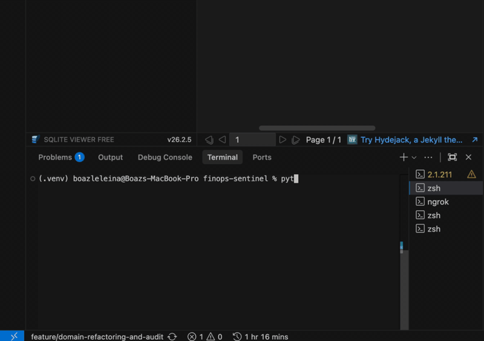
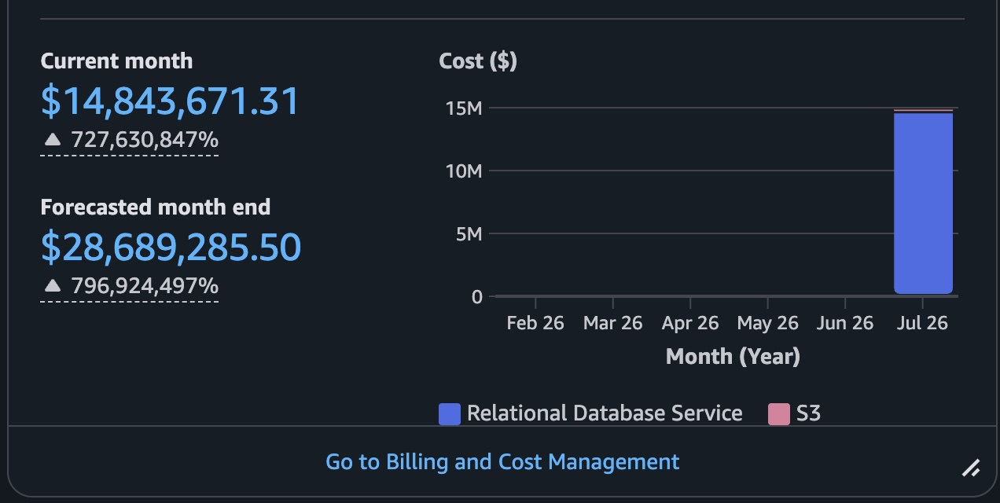

# FinOps Sentinel: Building an AWS Cost Agent That Deletes Things Safely

*An autonomous agent that finds cloud waste, prices it, explains it, and removes it — but only after a human says yes.*

**Repository: [github.com/boazleleina/finops-sentinel](https://github.com/boazleleina/finops-sentinel)**

---

## Demo

<video src="images/linkedin-demo.mp4" controls width="100%"></video>

*A scan across three AWS regions, findings posted to Slack, one approved, the volume snapshotted and deleted.*



---

## The problem

Cloud waste is not an event. It is accumulation.

An engineer terminates an instance; the EBS volume it booted from survives,
unattached, billing monthly. Someone reserves an Elastic IP for a migration that
finished last quarter. A staging database gets *stopped* rather than deleted —
still billing for allocated storage, and scheduled by AWS to restart itself
after seven days whether anyone wants it or not.

Every item is individually too small to chase. Together they are the line on the
bill nobody can account for.



The awkward part is that **this is not a detection problem.** An unattached
volume is one API call from obvious. The hard part is that acting on it means
deleting infrastructure in a live account, where the cost of one wrong deletion
dwarfs months of savings.

So tooling splits into two unsatisfying camps: dashboards that report waste and
leave a human to do all the work anyway, and automation that acts confidently
and occasionally deletes the wrong thing.

FinOps Sentinel is an attempt at the middle position. **The agent finds, prices,
explains, and executes the mechanics. A human decides, always.**

---

## What it does

Four verbs:

| Command | What happens |
|---|---|
| `sentinel scan` | Inventory every region, evaluate nine rules, persist findings, alert on new ones |
| Slack button / `POST /decisions/{id}` | A human approves or denies; guardrails re-checked; playbook runs |
| `sentinel digest` | Advisory patterns — right-sizing suggestions and spend anomalies. No buttons |
| `sentinel expire` | Findings nobody decided within 72 hours close themselves |

### The nine rules

| Rule | Detects | Actionable? |
|---|---|---|
| `ebs_unattached` | Volumes in `available` state | Yes — snapshot, then delete |
| `eip_orphaned` | Elastic IPs with no association | Yes — release |
| `ec2_stopped` | Instances stopped beyond threshold | Yes — terminate |
| `ebs_old_snapshot` | Snapshots past retention, or whose source volume is gone | Yes — delete |
| `ec2_idle` | Running instances, CPU **and** network flatlined | No — advisory |
| `rds_idle` | Databases with no connections across the window | No — advisory |
| `rds_stopped` | Databases in `stopped` state | No — advisory |
| `s3_no_lifecycle` | Buckets over a size threshold with no lifecycle policy | No — advisory |
| `s3_incomplete_multipart` | Multipart uploads abandoned past threshold | Yes — abort uploads |

The actionable/advisory split is not a maturity gradient. It is a safety
boundary, and it is enforced in two independent places.

A real scan:

```
Regions: us-east-1, eu-west-1, ap-southeast-2 (3)
Loaded 8 scanners per region.
Findings database: data/sentinel.db

Scan completed in 3.15s
Inventory Discovered: 45 resources

Findings Generated: 24 violations
Notifications Sent: 15 (via slack)

                         Optimization Opportunities
┏━━━━━━━━━━━━━━━━━━━━━━━━━━━━┳━━━━━━━━━━━━━━━━┳━━━━━━━━━━━━━━━━━━┳━━━━━━━━━━┓
┃ Resource ID                ┃ Region         ┃ Rule             ┃     $/mo ┃
┡━━━━━━━━━━━━━━━━━━━━━━━━━━━━╇━━━━━━━━━━━━━━━━╇━━━━━━━━━━━━━━━━━━╇━━━━━━━━━━┩
│ vol-d6e748bf37ac6ccec      │ us-east-1      │ ebs_unattached   │    $0.80 │
│ [P] vol-645a783cf3f376d0d  │ us-east-1      │ ebs_unattached   │    $1.60 │
│ eipalloc-db037e1ade3a739fc │ us-east-1      │ eip_orphaned     │    $3.65 │
│ i-da0a5c483e98127c9        │ us-east-1      │ ec2_idle         │   $70.08 │
│ i-a91ac43e9f2689209        │ eu-west-1      │ ec2_idle         │  $280.32 │
│ finops-demo-unmanaged-eu-… │ eu-west-1      │ s3_no_lifecycle  │   $18.40 │
└────────────────────────────┴────────────────┴──────────────────┴──────────┘
[P] protected by tag — reported, never notified, never remediated, and excluded
from the totals below.

Total Potential Monthly Savings: $540.02
```

---

## Design: ports and adapters

The system is built hexagonally. Business rules live in `domain/` and import
nothing but pydantic — no boto3, no SQLAlchemy, no HTTP client, no Slack SDK.

```
src/finops_sentinel/
├── domain/         # Pure business logic. No AWS, no HTTP, no SQL.
│   ├── models.py       # Entities + the state machine table
│   ├── rules.py        # Guardrails: protection tags, playbook allowlist
│   ├── services.py     # Use cases: run_scan, approve, deny, digest
│   ├── summaries.py    # Deterministic prose (the LLM fallback floor)
│   ├── rightsizing.py  # Pure: is this instance over-provisioned?
│   └── anomaly.py      # Pure: is today's waste statistically unusual?
│
├── ports/          # Abstract interfaces — the domain's vocabulary
│   ├── cloud.py        # CloudGateway
│   ├── repository.py   # FindingsRepository
│   ├── notifier.py     # Notifier
│   ├── advisor.py      # Advisor
│   ├── pricing.py      # Pricing
│   └── scanner.py      # Scanner
│
├── adapters/       # Concrete implementations
│   ├── aws/            # boto3 gateway, price tables, six scanners
│   ├── persistence/    # SQLAlchemy + SQLite
│   ├── notifications/  # Slack (Block Kit), Console
│   ├── advisor/        # Ollama (local LLM), Template
│   └── inbound/        # Typer CLI, FastAPI
│
├── bootstrap.py    # Composition root — the only file that wires
└── config.py       # Settings, one per env var
```

The dependency rule is enforced in CI, not by discipline:

```toml
[[tool.importlinter.contracts]]
name = "Domain is pure Python (pydantic only)"
type = "forbidden"
source_modules = ["finops_sentinel.domain"]
forbidden_modules = [
    "boto3", "botocore", "fastapi", "sqlalchemy", "alembic",
    "slack_sdk", "typer", "rich", "uvicorn", "httpx",
]
```

Import boto3 into the domain and the build fails with a named contract
violation.

**This changed the design at least once.** The spec for anomaly detection said
"deterministic pandas, in domain." But that contract is literally named "Domain
is pure Python (pydantic only)" — adding pandas would have made the name a lie.
A rolling z-score turned out to be twenty lines of `statistics`. A 60MB
dependency avoided because the architecture was enforced rather than merely
described.

---

## How a scan works

Two passes, and the reason for two is specific.

**Pass 1 — discovery.** Every scanner in every region returns
`(Resource, raw_provider_dict)` pairs. These are upserted; anything not seen
this scan is marked `DELETED`.

**Pass 2 — evaluation.** Each scanner receives its own region's inventory and
emits findings.

They are separate because **evaluation sometimes needs inventory the scanner did
not discover**. The `ec2_stopped` rule prices a stopped instance by summing its
still-billing EBS volumes — volumes that a *different* scanner found. Pass 1
builds the shared picture; pass 2 reads it.

```python
class Scanner(ABC):
    @abstractmethod
    def discover(self, gateway: CloudGateway) -> list[tuple[Resource, dict[str, Any]]]:
        """Pass 1: Discover resources from the cloud provider."""

    @abstractmethod
    def evaluate(self, resources: list[tuple[Resource, dict[str, Any]]]) -> list[Finding]:
        """Pass 2: Evaluate a list of resources to generate findings."""
```

### Three isolation boundaries

| Boundary | The failure it prevents |
|---|---|
| Per-region | One region's outage or missing IAM grant blinding all others |
| Per-scanner | One unavailable service discarding every other scanner's findings in that region |
| DELETED sweep scoped to succeeded regions | A failed region's inventory being marked deleted, silently disarming every finding it owns |

The per-scanner boundary was added after a real incident. Adding RDS scanners
broke `sentinel scan` outright on LocalStack: RDS raised, the region was marked
failed, and with one region configured the entire scan aborted. Every other
scanner's findings vanished.

On real AWS, a single missing IAM permission does exactly the same thing — and
"no findings" is indistinguishable from a clean account. That is the most
expensive failure mode this system has, so it is now structurally impossible:

```python
for index, scanner in enumerate(target.scanners):
    try:
        discovered.extend(scanner.discover(target.gateway))
    except Exception as exc:  # one bad scanner must not end the region
        failures[index] = f"{type(exc).__name__}: {exc}"
        logger.warning("Scanner %s failed in region %s: %s", ...)
```

And when *every* region fails, the scan raises rather than returning an empty
list:

```python
if targets and not inventory_by_region:
    raise RuntimeError("Every region failed to scan: " + ...)
```

Returning "no findings" there would read as a clean account. That is the most
expensive lie the system could tell.

---

## The state machine

Findings move through a lifecycle, and the transition table lives in the domain
next to the enum it governs:

```python
TRANSITIONS: dict[FindingStatus, set[FindingStatus]] = {
    FindingStatus.OPEN:     {FindingStatus.NOTIFIED},
    FindingStatus.NOTIFIED: {FindingStatus.APPROVED, FindingStatus.DENIED,
                             FindingStatus.EXPIRED},
    FindingStatus.APPROVED: {FindingStatus.REMEDIATED, FindingStatus.FAILED},
    # DENIED / REMEDIATED / FAILED / EXPIRED are terminal in v1
}
```

```
                    ┌──────────────── EXPIRED (72h, terminal)
                    │
   OPEN ──────▶ NOTIFIED ──────▶ DENIED (terminal)
    │               │
    │               └──────▶ APPROVED ──┬──▶ REMEDIATED (terminal)
    │                                   └──▶ FAILED (terminal)
    │
    └── protected findings stay here forever, by design
```

Four properties fall out of this:

- **A re-scan can never resurrect a decided finding.** `save_finding()` updates
  evidence, cost, and `last_seen_at`, but never touches `status`.
- **Alerts fire exactly once**, on `OPEN → NOTIFIED`. This is why a second scan
  sends no Slack messages — by design, not by bug.
- **Protected findings never leave `OPEN`.** Reported in the table, excluded
  from every total.
- **Dry-run stops at `APPROVED`.** Only real execution reaches `REMEDIATED`, so
  the status itself distinguishes "a human said yes" from "the cloud changed."

Transitions are atomic compare-and-swap:

```python
def transition_finding(self, finding_id, expected, new) -> bool:
    """UPDATE findings SET status=:new WHERE id=:id AND status=:expected.
    Returns True only if THIS call performed the transition (rowcount 1)."""
```

A Slack double-click, a race against the expiry job, or two concurrent scans
cannot execute a remediation twice. The second caller gets `rowcount 0`.

---

## The safety model

Five independent layers stand between a detection and a deletion. No single
failure removes more than one.

**1. Tag protection.** `finops:protected=true` — never notified, never
actionable. Re-checked at approval time against *current* tags, so if someone
tags a resource after the alert goes out, the newer intent wins.

**2. The playbook allowlist**, keyed by resource type:

```python
PLAYBOOK_ALLOWLIST: dict[ResourceType, str] = {
    ResourceType.EBS_VOLUME:   "snapshot_then_delete_volume",
    ResourceType.ELASTIC_IP:   "release_eip",
    ResourceType.EC2_INSTANCE: "terminate_stopped_instance",
    ResourceType.EBS_SNAPSHOT: "delete_ebs_snapshot",
    ResourceType.S3_BUCKET:    "abort_incomplete_multipart_uploads",
}
```

No entry, no action. `RDS_INSTANCE` is absent deliberately.

**3. Notify-only rules**, catching what a type-keyed allowlist cannot:

```python
NOTIFY_ONLY_RULES: frozenset[str] = frozenset(
    {"ec2_idle", "rds_idle", "rds_stopped", "s3_no_lifecycle"}
)
```

Two concrete disasters this prevents:

- An `ec2_idle` finding is on a **running** instance. The type-keyed allowlist
  would hand it `terminate_stopped_instance` — which does not check state.
- `s3_no_lifecycle` and `s3_incomplete_multipart` share `S3_BUCKET`. Approving
  "this bucket has no lifecycle policy" would abort multipart uploads, because
  that is the playbook registered for the type.

**4. Human approval.** Nothing is remediated automatically, ever. Every
execution traces to a named actor in the `decisions` table.

**5. `DRY_RUN`**, default `true`. Playbooks log what they would do and return
`{"dry_run": True}`.

On top of that, destructive playbooks build their own recovery path:

```python
def _snapshot_then_delete_volume(self, volume_id: str) -> dict[str, Any]:
    response = self.client.create_snapshot(VolumeId=volume_id, ...)
    snapshot_id = response["SnapshotId"]

    waiter = self.client.get_waiter("snapshot_completed")
    waiter.wait(SnapshotIds=[snapshot_id], WaiterConfig={"Delay": 15, "MaxAttempts": 40})

    self.client.delete_volume(VolumeId=volume_id)
    return {"snapshot_id": snapshot_id, "deleted_volume": volume_id}
```

The waiter is the point. Delete-first-and-hope-the-snapshot-lands makes the
operation irreversible on failure.

---

## Where the LLM fits (and where it does not)

A locally hosted model (Ollama, `qwen3:30b-a3b` by default) writes the
explanation attached to each notification. It occupies a deliberately small
role: **it never decides anything and never computes a number.**

```python
class Advisor(ABC):
    """The advisor is advisory only: it never decides, never remediates, and
    never gates a notification. Implementations MUST NOT raise — a summary is
    a nice-to-have, so an unreachable or misbehaving backend has to degrade to
    a deterministic template rather than block the pipeline."""
```

The never-raise contract lives in the **port**, not in each adapter, because a
summary is optional and a notification is not.

Four defences, because the prompt contains user-controlled AWS tags:

1. **An evidence allowlist.** Only ~12 named keys reach the prompt.
2. **Field relabelling.** The model read `observation_days` as "running for 14
   days," so it is renamed to `metric_window_days` *in the prompt only* — stored
   evidence keeps the scanner's keys.
3. **Structured output.** The Pydantic schema is handed to Ollama's `format`
   field *and* used to validate the reply, so a model ignoring the constraint is
   caught rather than trusted.
4. **Output is untrusted display copy.** Rendered in its own Slack block, never
   parsed, never used to build action values. Buttons carry system-generated IDs.

```python
def summarize(self, finding: Finding, resource: Resource) -> str:
    fallback = render_template_summary(finding, resource)
    try:
        parsed = self.advise(finding, resource)
    except (httpx.HTTPError, json.JSONDecodeError, ValidationError, KeyError) as exc:
        logger.warning("Ollama advisor failed for finding %s (%s); using template", ...)
        return fallback
    return f"{parsed.summary} (risk: {parsed.risk}) Next step: {parsed.recommended_action}"
```

Kill Ollama mid-run and the pipeline does not notice — the deterministic
template writes the same explanation.

---

## Two rules worth explaining

### Right-sizing uses peak CPU, never average

```python
if len(cpu_series) < min_datapoints:
    return None                      # no history is not evidence
max_cpu = max(cpu_series)
if max_cpu >= cpu_headroom_percent:
    return None                      # it gets busy; leave it alone
```

An instance that idles all day and pegs 90% CPU once an hour has a mean around
4%. A mean-based tool recommends halving the machine that carries the actual
workload. **Averages are how right-sizing tools produce advice that takes
production down.**

The 40% default pairs with a candidate table that steps down *at most one size*
— halving vCPU roughly doubles utilisation, so a 40% peak lands near 80% on the
target. Raising the threshold without shortening the candidate list breaks that
pairing silently, so both places say so.

### Anomaly detection refuses to guess

```python
ordered  = sorted(snapshots, key=lambda s: s.snapshot_date)
latest   = ordered[-1]
baseline = ordered[-(window_days + 1):-1]      # candidate day EXCLUDED

if len(baseline) < min_history_days: return None
stdev = statistics.stdev(values)
if stdev == 0: return None
z = (value - mean) / stdev
if abs(z) < z_threshold: return None
```

Every guard returns `None` — *no verdict* — rather than a weak one. An anomaly
alert that fires on three days of history trains people to ignore it, which
costs more than the alert it replaced.

Excluding the candidate day from its own baseline is load-bearing: with seven
points, a spike included in the mean and stdev it is measured against inflates
both enough to hide itself.

And the honesty constraint: there is no billing data in this system, so what is
measured is **estimated waste**, not spend. Every user-facing string says so:

```
No spend anomaly (or too little history to judge — needs 7 days of scans).
```

"Too little history to judge" and "no anomaly" are different statements, and
only one of them is reassuring.

---

## Cost estimation, honestly

Every rate lives in one file with sources cited, behind a `Pricing` port. Three
caveats are documented at the top because they bound how far the numbers can be
trusted:

1. Other regions cost more — the table applies us-east-1 rates everywhere.
2. **List price is not your price.** Reserved Instances and Savings Plans reduce
   it, and a commitment-covered instance saves nothing when deleted.
3. Snapshots bill on incremental blocks, so snapshot estimates are upper bounds.

Defaults are **mid-range, never cheapest** — an unknown instance type must not
be dismissed as negligible, but must not manufacture savings that dwarf real
findings either.

The most interesting case is S3:

```python
# Only a fraction of a bucket is ever cold enough to tier or expire.
# Reporting the whole bucket as recoverable would let one large bucket
# dominate the savings total and make every number in the report
# untrustworthy. The inputs are in evidence so the estimate is auditable.
addressable = full_cost * Decimal(str(self.addressable_fraction))
```

A bucket without a lifecycle policy is not 100% waste. So the finding reports
20% of its storage cost, and the fraction, the raw size, and the full cost all
go into `evidence` so the number is auditable rather than magic.

---

## Testing

**277 tests. 96% overall coverage, 100% on the domain layer.**

| Layer | Tooling | What it proves |
|---|---|---|
| Domain | In-memory fakes | Guardrails, state machine, pure rules — no AWS at all |
| Adapters | `moto` | Scanners against a simulated AWS API |
| LLM | `respx` | Every advisor failure: timeout, transport error, bad JSON, schema violation |
| Integration | LocalStack | Seed → scan → approve → resource actually gone → audit complete |

The gate is split rather than flat:

```bash
pytest tests/ --cov=src/finops_sentinel --cov-fail-under=90
coverage report --include='*/domain/*' --fail-under=95
```

A flat 90% would let the domain rot to 85% as long as adapters compensated —
backwards, since the domain is the part that must never break. A flat 95% global
would push toward thin mock-boto3 tests written purely to move a number.

The test that justifies the architecture runs the entire approve-and-remediate
flow with a fake gateway, an in-memory repository, and a fake notifier. Zero
AWS, zero HTTP, zero Slack. If it passes, swapping Slack for Telegram cannot
break the approval logic.

---

## Three bugs that only appeared when I ran it

**1. CloudWatch dimension sets.** The metric port originally took a single
dimension name/value pair. S3's `BucketSizeBytes` is published against
`BucketName` **and** `StorageType`, and CloudWatch matches dimension sets
*exactly* — a query naming one returns nothing.

Every bucket would have read as "size unknown" in production, and no S3 finding
would ever have fired. **Neither moto nor LocalStack publishes that metric**, so
no end-to-end test could have caught it: empty is also what "no data"
legitimately looks like.

**2. The migration that silently kept the old constraint.** Widening a CHECK
constraint on SQLite requires rebuilding the table. The first version used
`table_args`, which *adds to* a reflected definition rather than replacing it —
so the rebuilt table carried both the old four-value constraint and the new
six-value one, and the old one still rejected every new row. It ran without
error. Only dumping the schema revealed it.

**3. Alembic migrating a different database than the app used.** `env.py` read
`SENTINEL_DB_PATH` with `os.getenv`; the app read it through pydantic-settings,
which also reads `.env`. Since the documented setup puts the path in `.env` and
not the shell, **every migration ever run landed on the wrong file.** No symptom
for two months, because earlier migrations only created tables SQLAlchemy would
have created anyway. The first migration whose table nothing else creates
surfaced it instantly.

The fix was giving the URL exactly one owner:

```python
def database_url() -> str:
    """Both the application and Alembic call this. They used to build it
    independently, and drifted."""
    return f"sqlite:///{settings.sentinel_db_path}"
```

All three argue the same thing: **a green test suite is not the same as a
working system.** Each was found by running the thing against a real
environment.

---

## Running it

```bash
git clone https://github.com/boazleleina/finops-sentinel.git
cd finops-sentinel
cp .env.example .env

docker compose --profile dev up -d          # LocalStack + API
alembic upgrade head
python3 scripts/seed_localstack.py          # seeds realistic waste
sentinel scan
sentinel digest
```

The seed script creates unattached volumes (one tagged protected), an orphaned
Elastic IP, a stopped instance, orphaned snapshots, an idle running instance
with flat CloudWatch metrics, and four S3 buckets — one unmanaged, one with a
lifecycle policy that must *not* be flagged, one protected, one holding an
abandoned multipart upload.

LocalStack and real AWS are interchangeable via one environment variable. No
code path differs.

---

## What I would build next

- **Kubernetes deployment** — CronJob for scanning, Deployment for the API,
  Helm chart for thresholds and secrets.
- **Terraform + real AWS** in read-only `DRY_RUN=true` mode, which is also when
  the RDS scanners finally get end-to-end coverage (LocalStack's RDS is
  Pro-tier).
- **Cost Explorer adapter.** The anomaly detector monitors *estimated waste*
  today. A Cost Explorer implementation of the same port would swap in real
  billing data without the z-score logic changing at all — the port design
  paying off.
- **Mutation testing** on the domain layer. Coverage measures execution, not
  assertion; `mutmut` deletes assertions and checks the tests fail.

---

## The takeaway

The interesting engineering here is not the AWS integration. It is that the
rules deciding whether to delete infrastructure are pure functions, testable
without a network, enforced by CI to stay that way, and wrapped in five
independent guardrails — so that the scariest thing the system does is also the
part that is easiest to reason about.

**[github.com/boazleleina/finops-sentinel](https://github.com/boazleleina/finops-sentinel)**

Full engineering documentation, including every port, adapter, and design
decision, is in [`ARCHITECTURE.md`](https://github.com/boazleleina/finops-sentinel/blob/main/ARCHITECTURE.md).
